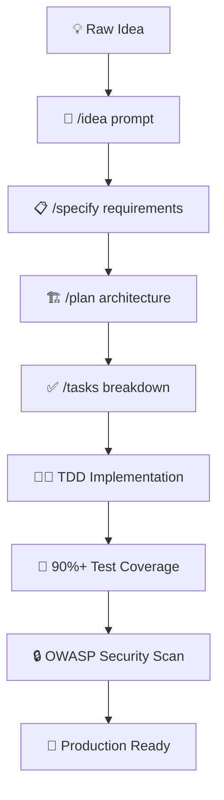

<div align="center" style="background-color: #f8f9fa; padding: 20px; border-radius: 10px; margin: 20px 0;">
  
</div>

# 🏛️ Spec-Kit: Constitutional Development Framework

<div align="center">

**A revolutionary constitutional specification-driven development framework from raw ideas into solution.**

[](LICENSE)
[](https://github.com/plaesy/spec-kit/releases)
[](https://github.com/pre-commit/pre-commit)
[](https://conventionalcommits.org)
[](memory/constitution.md)
[](instructions/security-and-owasp.instructions.md)
[](memory/constitution.md)

</div>

<!-- Mobile-friendly quick navigation -->
<div align="center">

**🚀 Quick Jump**: 
[Install](#-quick-start) • 
[Demo](#-interactive-demo) • 
[Docs](#-documentation) • 
[Help](#-troubleshooting) • 
[Contribute](#-contributing)

</div>

## 📑 Table of Contents

<details>
<summary><strong>📋 Click to expand full navigation</strong></summary>

- [🌟 What is Plaesy Spec-Kit?](#-what-is-plaesy-spec-kit)
  - [🎬 See It In Action](#-see-it-in-action)
  - [🏆 Why Developers Choose Spec-Kit](#-why-developers-choose-spec-kit)
  - [📈 Adoption & Performance Metrics](#-adoption--performance-metrics)
- [⚡ Prerequisites](#-prerequisites)
  - [System Requirements](#system-requirements)
  - [Required Dependencies](#required-dependencies)
- [🚀 Quick Start](#-quick-start)
  - [🏗️ Initialize Your First Project](#️-initialize-your-first-project)
  - [🎯 Interactive Demo](#-interactive-demo)
  - [🔄 Upgrade & Maintenance](#-upgrade--maintenance)
  - [👥 Team Scale Recommendations](#-team-scale-recommendations)
- [🏗️ Architecture & Framework Structure](#️-architecture--framework-structure)
  - [� Directory Structure](#-directory-structure)
- [�📖 Documentation](#-documentation)
  - [🤖 AI Role-Based Prompting System](#-ai-role-based-prompting-system)
  - [🤖 Supported AI Assistants](#-supported-ai-assistants)
  - [📋 Role-Based Agent Templates](#-role-based-agent-templates)
- [🔒 Security & Compliance](#-security--compliance)
  - [OWASP Compliance](#owasp-compliance)
- [❓ FAQ](#-faq)
  - [General Questions](#general-questions)
  - [Technical Questions](#technical-questions)
- [🐛 Troubleshooting](#-troubleshooting)
  - [Installation Issues](#installation-issues)
  - [Runtime Issues](#runtime-issues)
  - [Getting Help](#getting-help)
- [🤝 Contributing](#-contributing)
  - [🌟 Ways to Contribute](#-ways-to-contribute)
  - [🚀 Development Process](#-development-process)
  - [🎯 Contribution Guidelines](#-contribution-guidelines)
- [📄 License & Legal](#-license--legal)

</details>


---

## 🌟 What is Plaesy Spec-Kit?

Plaesy Spec-Kit is **not** a traditional software project—it's a **meta-framework** for building projects using constitutional development principles. It enforces disciplined development practices through simple, structured, and automated workflows that ensure quality, security, and maintainability from the ground up.

### 🎬 See It In Action

**From Idea to Production in Minutes**



## ⚡ Prerequisites

### System Requirements

| Platform | Minimum Requirements | Recommended |
|----------|---------------------|-------------|
| **Linux** | Ubuntu 18.04+, CentOS 7+ | Ubuntu 22.04+ |
| **macOS** | macOS 10.15+ | macOS 12+ |
| **Windows** | Windows 10+ | Windows 11 |

### Required Dependencies

```bash
# Check if you have required tools
curl --version     # Required for installation
git --version      # Required for version control
bash --version     # Required for scripts (Linux/macOS)
```

## 🚀 Quick Start

**Linux/macOS:**
```bash
/bin/bash <(curl -s https://raw.githubusercontent.com/plaesy/spec-kit/main/scripts/bash/install.sh)
```

**Windows (PowerShell):**
```powershell
iwr -useb https://raw.githubusercontent.com/plaesy/spec-kit/main/scripts/powershell/install.ps1 | iex
```

### 🏗️ Initialize Your First Project

```bash
# Create new project with constitutional framework
plaesy init my-awesome-app

# Initialize in current directory
plaesy init .

# Initialize with specific AI assistant (14 options available)
plaesy init my-app --ai copilot      # GitHub Copilot
plaesy init my-app --ai cursor       # Cursor AI
plaesy init my-app --ai windsurf     # Windsurf AI  
plaesy init my-app --ai claude       # Claude Code
plaesy init my-app --ai trae-ai      # Trae.ai multi-agent
plaesy init my-app --ai qwen-code    # Qwen Code
plaesy init my-app --ai codex-cli    # Codex CLI
plaesy init my-app --ai opencode-cli # OpenCode CLI

# Navigate to project
cd my-awesome-app
```

#### 📋 Management Commands

```bash
plaesy status               # Show installation status and version
plaesy version              # Show version information only
plaesy help                 # Show all available commands
plaesy install              # Reinstall framework
plaesy repair               # Fix missing scripts after upgrade
plaesy diagnose             # Check installation health and diagnose issues
```

### 🔄 Upgrade & Maintenance

#### 🆙 Upgrade to Latest Version

**Using CLI (Recommended):**
```bash
plaesy upgrade              # Cross-platform upgrade command
```

**Manual Upgrade:**
```bash
# Linux/macOS
curl -s https://raw.githubusercontent.com/plaesy/spec-kit/refs/heads/main/scripts/bash/install.sh | bash -s -- --upgrade

# Windows (PowerShell)
iwr -useb https://raw.githubusercontent.com/plaesy/spec-kit/refs/heads/main/scripts/powershell/install.ps1 | iex -upgrade
```

#### 🗑️ Uninstall

**Using CLI:**
```bash
plaesy uninstall            # Interactive uninstall with confirmation
```

**Manual Uninstall:**
```bash
# Linux/macOS
curl -s https://raw.githubusercontent.com/plaesy/spec-kit/refs/heads/main/scripts/bash/install.sh | bash -s -- --uninstall

# Windows (PowerShell)  
iwr -useb https://raw.githubusercontent.com/plaesy/spec-kit/refs/heads/main/scripts/powershell/install.ps1 | iex -uninstall
```

**What gets removed during uninstall:**
- ✅ Framework directory (`~/.plaesy`)
- ✅ CLI command (`plaesy`)
- ✅ Shell PATH modifications
- ✅ Automatic backup creation
- ❌ Your project files (remain untouched)

#### Method 1: AI-Powered Quick Start (Recommended)

Using any AI assistant with framework prompts:
```markdown
# 1. Ideation: Capture your idea
Chat: "/idea Build a privacy-first photo organizer that automatically groups images by event, location, and people."

# 2. Specification: Define requirements
Chat: "/specify The app should allow users to import photos, auto-group them by date, location, and detected faces, and let users manually tag or re-organize albums. Albums must support drag-and-drop reordering and bulk actions. All data is stored locally for privacy."

# 3. Planning: Outline technical approach
Chat: "/plan Use Vite for project scaffolding. Implement core features with vanilla HTML, CSS, and JavaScript. Store images and metadata in a local SQLite database accessed via a lightweight Node.js CLI. Ensure CLI supports --help, --version, and --format=json|text flags."

# 4. Task Breakdown: Actionable steps with TDD
Chat: "/tasks List granular development tasks for TDD: 
- Set up project structure and CLI interface
- Implement photo import and metadata extraction
- Develop auto-grouping logic (date, location, faces)
- Enable album creation, tagging, and drag-and-drop reordering
- Write tests for each feature before implementation
- Integrate local SQLite storage and validate data integrity
- Add structured logging and performance metrics"
```

#### Method 2: Role-Based AI Collaboration

Using any AI assistant with role-specific guidance:

```markdown
# 1. Business Requirements Analysis
Chat: "@bo Define user authentication system requirements following constitutional principles"

# 2. Technical Architecture Design
Chat: "@sa Design authentication architecture with JWT"

# 3. TDD Implementation
Chat: "@dev Implement user login with strict TDD Red-Green-Refactor cycle"

# 4. Quality Assurance Validation
Chat: "@qa Create comprehensive test suite with 90% coverage requirement"

# 5. Documentation Creation
Chat: "@tw Document the authentication system API, usage instructions, and integration guidelines following constitutional standards"

# 6. Deployment Planning
Chat: "@devops Outline deployment steps and rollback strategy for authentication feature"

# 7. Security Review
Chat: "@security Perform OWASP compliance review and update security documentation"

# 8. Community Feedback
Chat: "@bo Gather user feedback and document improvement suggestions"
```

### 👥 Team Scale Recommendations

The framework adapts to your team size with specific guidance for each scale:

| Team Size | Focus | Essential Practices | Technology Stack | Constitutional Rules |
|-----------|-------|-------------------|------------------|---------------------|
| **🧑‍💻 1 person** | Speed, experimentation | Basic TDD, manual testing | React + Node.js + SQLite | Simplified quality gates |
| **👥 2-5 people** | Collaboration, PR reviews | 70%+ coverage, automated CI/CD | PostgreSQL + Docker | Mandatory code reviews |
| **🏢 6-15 people** | Process standardization | 85%+ coverage, feature flags | Microservices + Kubernetes | Cross-team interface contracts |
| **🏭 16-50 people** | Cross-team coordination | Contract testing, service mesh | Platform engineering + Istio | Architecture review board |
| **🌐 51+ people** | Enterprise governance | Compliance automation, zero-trust | Enterprise architecture | Constitutional steering committee |

[# top](#-table-of-contents)

## 🏗️ Architecture & Framework Structure

### 📁 Directory Structure

```
spec-kit/                               # Constitutional Framework Root
├── 📋 chatmodes/                       # Universal AI Role Templates
│   ├── ba.chatmode.md                  # Business Analyst role prompt template
│   ├── bo.chatmode.md                  # Business Owner role prompt template
│   ├── designer.chatmode.md            # UI/UX Designer role prompt template
│   ├── dev.chatmode.md                 # Full Stack Developer role prompt template
│   ├── devops.chatmode.md              # DevOps Engineer role prompt template
│   ├── pe.chatmode.md                  # Prompt Engineer role prompt template
│   ├── pm.chatmode.md                  # Product Manager role prompt template
│   ├── po.chatmode.md                  # Product Owner role prompt template
│   ├── qa.chatmode.md                  # Quality Assurance role prompt template
│   ├── sa.chatmode.md                  # Solution Architect role prompt template
│   ├── security.chatmode.md            # Security Specialist role prompt template
│   ├── sm.chatmode.md                  # Scrum Master role prompt template
│   ├── tw.chatmode.md                  # Technical Writer role prompt template
│   └── ...                             # Additional role-specific prompt templates for other team roles
├── ✅ checklists/                      # Quality Gate Validations
│   ├── story-done.checklist.md         # Checklist for completed development stories
│   ├── qa.checklist.md                 # Checklist for quality assurance validation
│   └── constitutional.checklist.md     # Checklist for constitutional framework compliance
├── 📝 instructions/                    # Technology-Specific Guidelines
│   ├── tdd-enforcement.instructions.md # Instructions for enforcing TDD principles
│   ├── security-and-owasp.instructions.md # Security and OWASP compliance instructions
│   └── [language].instructions.md      # Framework integration instructions for each supported technology
├── 🧠 memory/                          # Constitutional Knowledge Base
│   ├── constitution.md                 # [NON-NEGOTIABLE RULES] for development
│   ├── knowledge-base.md               # Core framework principles and reusable patterns
│   └── test-priorities-matrix.md       # Matrix for prioritizing test strategies
├── 🎯 prompts/                         # Structured Prompt Templates
│   ├── idea.prompt.md                  # Template for capturing new ideas
│   ├── specify.prompt.md               # Template for writing specifications
│   ├── plan.prompt.md                  # Template for technical planning
│   ├── tasks.prompt.md                 # Template for breaking down implementation tasks
│   └── remember.prompt.md              # Template for saving decisions to the knowledge base
├── 🔧 scripts/                         # Automation & Workflow Tools
│   ├── constitutional-validator.sh     # Script for validating constitutional compliance
│   ├── ai-agent-orchestrator.sh        # Script for coordinating multiple AI agents
│   ├── create-new-feature.sh           # Script for scaffolding new features
│   └── setup-plan.sh                   # Script for initializing project plans
└── 📄 templates/                       # Content Structure Templates
    ├── spec.template.md                # Template for business specifications
    ├── plan.template.md                # Template for technical architecture documentation
    └── task.template.md                # Template for implementation task lists
```

[# top](#-table-of-contents)

## 📖 Documentation

### 🤖 AI Role-Based Prompting System

The framework provides role-specific prompt templates that work with **any AI assistant**. Our enhanced installer now supports 14 different AI platforms and tools:

#### 🤖 Supported AI Assistants

| Category | AI Assistant | Configuration | Usage Pattern |
|----------|-------------|---------------|---------------|
| **GitHub Native** | [GitHub Copilot](https://github.com/features/copilot) | `.github/chatmodes/` | `/idea`, `/specify`, `/plan`, `/tasks` commands |
| **Advanced Editors** | [Cursor AI](https://cursor.sh/) | `.cursor/rules/plaesy/` | `@agent-name` for roles, `/command` for workflows |
| | [Windsurf AI](https://windsurf.ai/) | `.windsurf/rules/plaesy/` | `@dev`, `@architect`, `@qa` constitutional roles |
| **Cloud Platforms** | [Claude Code](https://claude.ai/) | `.claude/commands/plaesy/` | `/agent-name` for constitutional development |
| | [ChatGPT](https://openai.com/chatgpt) | `.ai-config/openai/` | Load constitutional prompts manually |
| | [Gemini](https://gemini.google.com/) | `.ai-config/gemini/` | Role-based prompts with quality gates |
| **Advanced AI** | [Trae.ai](https://trae.ai/) | `.trae/agents/plaesy/` | Multi-agent constitutional workflows |
| | [Qwen Code](https://qwenlm.github.io/) | `.qwen/plaesy-method/` | `/plaesy:dev`, `/plaesy:architect` commands |
| | [Kilo Code](https://kilo.dev/) | `.kilocodemodes` | `plaesy-dev`, `plaesy-architect` modes |
| **CLI Tools** | [Codex CLI](https://codex.dev/) | `AGENTS.md` project memory | "As dev, please..." natural language |
| | [Codex Web](https://codex.dev/) | `AGENTS.md` + git committed | Cloud-based constitutional agents |
| | [OpenCode CLI](https://opencode.ai/) | `opencode.jsonc` config | Constitutional framework in CLI |
| **Local/Custom** | Local AI (Ollama/LM Studio) | `.ai-config/local/` | Constitutional system prompts |
| **Manual** | No AI (Manual) | `FRAMEWORK-GUIDE.md` | Template-based development |

#### 🚀 Installation Examples

```bash
# Install with specific AI assistant
plaesy init . --ai copilot     # GitHub Copilot integration
plaesy init . --ai cursor      # Cursor AI with constitutional rules  
plaesy init . --ai windsurf    # Windsurf AI configuration
plaesy init . --ai trae-ai     # Trae.ai multi-agent workflows
plaesy init . --ai codex-cli   # Codex CLI with project memory
```

#### 📋 Role-Based Agent Templates

The framework provides role-specific prompt templates that work with all supported AI assistants:

| Role | Prompt Template File | Specialization | Usage Example |
|------|---------------------|----------------|---------------|
| 👔 **Business Owner** | [bo.chatmode.md](chatmodes/bo.chatmode.md) | Strategic vision, ROI analysis | `Load bo.chatmode.md → Ask: "Define requirements for user management"` |
| 📊 **Business Analyst** | [ba.chatmode.md](chatmodes/ba.chatmode.md) | Requirements gathering | `Load ba.chatmode.md → Ask: "Analyze user workflow requirements"` |
| 🏗️ **Solution Architect** | [sa.chatmode.md](chatmodes/sa.chatmode.md) | Technical architecture | `Load sa.chatmode.md → Ask: "Design microservices architecture"` |
| 📱 **Product Manager** | [pm.chatmode.md](chatmodes/pm.chatmode.md) | Product strategy | `Load pm.chatmode.md → Ask: "Create product roadmap for Q1"` |
| 👨‍💻 **Developer** | [dev.chatmode.md](chatmodes/dev.chatmode.md) | Implementation & coding | `Load dev.chatmode.md → Ask: "Implement authentication with TDD"` |
| 🔍 **QA Engineer** | [qa.chatmode.md](chatmodes/qa.chatmode.md) | Testing & quality | `Load qa.chatmode.md → Ask: "Create comprehensive test suite"` |
| 🚀 **DevOps** | [devops.chatmode.md](chatmodes/devops.chatmode.md) | Infrastructure & deployment | `Load devops.chatmode.md → Ask: "Set up CI/CD pipeline"` |
| 🔒 **Security** | [security.chatmode.md](chatmodes/security.chatmode.md) | Security & compliance | `Load security.chatmode.md → Ask: "Perform OWASP security review"` |
| 🎨 **Designer** | [designer.chatmode.md](chatmodes/designer.chatmode.md) | UI/UX design | `Load designer.chatmode.md → Ask: "Design user-friendly login flow"` |
| 📝 **Tech Writer** | [tw.chatmode.md](chatmodes/tw.chatmode.md) | Documentation | `Load tw.chatmode.md → Ask: "Write API documentation"` |

[# top](#-table-of-contents)

## 🔒 Security & Compliance

### OWASP Compliance

The framework enforces OWASP Top 10 security practices:

| OWASP Category | Framework Enforcement | Validation Method |
|---------------|----------------------|-------------------|
| **A01: Broken Access Control** | Principle of least privilege | Automated security scan |
| **A02: Cryptographic Failures** | AES-256, Argon2/bcrypt | Dependency validation |
| **A03: Injection** | Parameterized queries mandatory | Static code analysis |
| **A04: Insecure Design** | Security-first design patterns | Architecture review |
| **A05: Security Misconfiguration** | Secure defaults enforcement | Configuration audit |
| **A06: Vulnerable Components** | Automated dependency scanning | Daily security updates |
| **A07: Authentication Failures** | MFA support, secure sessions | Authentication testing |
| **A08: Data Integrity Failures** | Secure deserialization | Data validation tests |
| **A09: Logging Failures** | Security event logging | Log analysis |
| **A10: SSRF** | Allowlist validation | Network security testing |

[# top](#-table-of-contents)

## ❓ FAQ

### General Questions

**Q: What makes this different from other development frameworks?**
A: Spec-Kit enforces "constitutional development" - non-negotiable rules for TDD, security, and quality that are automatically validated at every step.

**Q: Can I use this with existing projects?**
A: Yes! Run `plaesy init .` in any existing project directory to add constitutional framework support.

**Q: Which AI assistant works best with Spec-Kit?**
A: All 14 supported AI assistants work well. Choose based on your preference:
- **GitHub Copilot**: Best for VS Code users
- **Cursor AI**: Best for advanced AI-assisted coding
- **Trae.ai**: Best for multi-agent workflows
- **Local AI**: Best for privacy-conscious developers

**Q: Is this suitable for enterprise use?**
A: Absolutely! The framework scales from individual developers to 51+ person teams with enterprise governance features.

### Technical Questions

**Q: Does this work with my favorite programming language?**
A: Yes! The framework is language-agnostic and includes specific instructions for JavaScript, TypeScript, Python, Go, Rust, Java, C#, Ruby, and more.

**Q: Can I customize the constitutional rules?**
A: The core constitutional principles are non-negotiable, but you can extend them with project-specific rules in your local `constitution.md`.

**Q: How does the TDD enforcement work?**
A: The framework includes automated validation that ensures tests are written before code, maintains 90%+ coverage, and follows Red-Green-Refactor cycles.

## 🐛 Troubleshooting

### Installation Issues

**Problem: `plaesy` command not found after installation**
```bash
# Solution: Reload your shell configuration
source ~/.bashrc    # Linux
source ~/.zshrc     # macOS with zsh
# Or restart your terminal
```

**Problem: Permission denied during installation**
```bash
# Solution: Check curl/wget permissions
chmod +x /tmp/plaesy-install.sh

# For manual installation, ensure you have write access to:
# - ~/.plaesy (framework directory)
# - ~/.bashrc or ~/.zshrc (PATH modification)
```

**Problem: Installation fails on Windows**
```powershell
# Solution: Enable execution policy
Set-ExecutionPolicy -ExecutionPolicy RemoteSigned -Scope CurrentUser

# Then retry installation
iwr -useb https://raw.githubusercontent.com/plaesy/spec-kit/refs/heads/main/scripts/powershell/install.ps1 | iex
```

### Runtime Issues

**Problem: AI assistant integration not working**
```bash
# Solution: Verify AI assistant is properly configured
plaesy diagnose    # Run diagnostics

# Check if config files exist:
ls ~/.plaesy/ai-config/     # Should show your AI assistant config
```

**Problem: Scripts not executing**
```bash
# Solution: Check script permissions (platform-specific)
# Linux/macOS:
chmod +x ~/.plaesy/scripts/bash/*.sh

# Windows (PowerShell):
# Scripts should have execution policy set during installation

# Repair installation if needed
plaesy repair
```

### Getting Help

- 📧 **Email**: [support@plaesy.dev](mailto:support@plaesy.dev) *(Note: Support email in development)*
- 💬 **GitHub Discussions**: [Start a discussion](https://github.com/plaesy/spec-kit/discussions)
- 🐛 **Bug Reports**: [Report an issue](https://github.com/plaesy/spec-kit/issues)
- 📖 **Documentation**: [Project Documentation](https://github.com/plaesy/spec-kit/wiki) *(Wiki-based docs)*

[# top](#-table-of-contents)

## 🤝 Contributing

We welcome contributions that align with our constitutional principles! Here's how you can help improve Spec-Kit:

### 🌟 Ways to Contribute

| Contribution Type | Description | Getting Started |
|-------------------|-------------|-----------------|
| 🐛 **Bug Reports** | Found an issue? Report it! | [Open an issue](https://github.com/plaesy/spec-kit/issues) |
| 💡 **Feature Requests** | Have ideas for improvements? | [Start a discussion](https://github.com/plaesy/spec-kit/discussions) |
| 📝 **Documentation** | Help improve docs | Edit files and submit PR |
| 🤖 **AI Assistant Support** | Add new AI integrations | Follow integration guidelines |
| 🔧 **Code Contributions** | Fix bugs or add features | Follow development process |

### 🚀 Development Process

1. **Fork & Clone**
   ```bash
   git clone https://github.com/your-username/spec-kit.git
   cd spec-kit
   ```

2. **Follow Constitutional Development**
   ```bash
   # Initialize constitutional framework in your fork
   plaesy init . --ai your-preferred-assistant
   
   # Follow TDD principles for all changes
   # 1. Write failing tests first (Red)
   # 2. Implement minimal code (Green)  
   # 3. Refactor and improve (Refactor)
   ```

3. **Quality Gates**
   - ✅ All tests must pass
   - ✅ 90%+ test coverage required
   - ✅ OWASP security compliance
   - ✅ Documentation updated
   - ✅ Constitutional validation passed

4. **Submit Pull Request**
   ```bash
   git checkout -b feature/your-feature-name
   git commit -m "feat: your feature description"
   git push origin feature/your-feature-name
   ```

### 🎯 Contribution Guidelines

#### Code Standards
- Follow existing code style and patterns
- Include comprehensive tests for all changes
- Maintain security-first development practices
- Document all public APIs and features

#### AI Assistant Integration
- Support multiple AI platforms (not just one)
- Follow the established chatmode template structure
- Ensure constitutional principles are enforced
- Test integration with at least 2 different AI assistants

#### Documentation
- Update README.md for user-facing changes
- Add examples for new features
- Include troubleshooting information
- Maintain consistency with existing documentation style

## 🔧 Troubleshooting

Experiencing issues with installation or platform compatibility? We've got you covered!

### Quick Fixes

- **Command not found**: Ensure `~/.local/bin` is in your PATH
- **Wrong scripts installed**: Use the correct platform installer (install.sh for Linux/macOS, install.ps1 for Windows)  
- **Installation fails**: Check internet connection and disk space (minimum 50MB)
- **Mixed script types**: Perform clean reinstall with `rm -rf ~/.plaesy && bash install.sh`

### Comprehensive Guide

For detailed troubleshooting including:
- Platform-specific script filtering issues
- Performance optimization tips  
- Advanced debugging techniques
- Common error messages and solutions

👉 **See our [Troubleshooting Guide](TROUBLESHOOTING.md)**

### Getting Help

- 🐛 **Bug reports**: [GitHub Issues](https://github.com/plaesy/spec-kit/issues)
- 💬 **Questions**: [GitHub Discussions](https://github.com/plaesy/spec-kit/discussions)  
- 🔍 **Check logs**: Run `plaesy diagnose` for system health check

---

## 🤝 Contributing

We welcome contributions that align with our constitutional principles of **quality**, **security**, and **developer experience**.

### 🏆 Recognition

Contributors who follow constitutional principles and make significant improvements will be:
- Added to the contributors list
- Invited to join the Constitutional Steering Committee (for major contributors)
- Given priority support for their own projects using Spec-Kit

### 📋 Before Contributing

1. Read our [Constitution](memory/constitution.md) to understand core principles
2. Review existing [issues](https://github.com/plaesy/spec-kit/issues) and [discussions](https://github.com/plaesy/spec-kit/discussions)
3. Set up your development environment with `plaesy init . --ai your-assistant`
4. Run `plaesy diagnose` to ensure everything is working correctly

---

*© 2025 Plaesy. Released under the [MIT License](LICENSE). Constitutional development framework for the modern developer.*