# Plaesy Chat Modes: Role-Specific AI Agent Personas

This directory contains a comprehensive collection of specialized AI agent personas designed to support different roles in the software development and product lifecycle. Each chat mode provides focused expertise and tailored communication styles to help with specific aspects of project development.

## 🎭 Overview

Chat modes are role-specific AI agent configurations that transform the AI assistant into specialized personas with:
- **Focused Expertise**: Deep knowledge in specific domains
- **Tailored Communication**: Role-appropriate language and approach
- **Relevant Tools**: Access to tools most relevant to each role
- **Structured Deliverables**: Outputs that match professional standards

## 📋 Available Chat Modes

### Core Development Roles

| Chat Mode | Role | Primary Focus | Key Capabilities |
|-----------|------|---------------|------------------|
| **`dev`** | Full Stack Developer | End-to-end development | Frontend, backend, APIs, testing, deployment |
| **`qa`** | Test Architect & Quality Advisor | Quality assurance | Test strategies, automation, quality metrics |
| **`devops`** | DevOps Engineer | Infrastructure & deployment | CI/CD, containerization, monitoring, cloud |
| **`security`** | Security Specialist | Security & compliance | Vulnerability assessment, secure coding, compliance |

### Product & Business Roles

| Chat Mode | Role | Primary Focus | Key Capabilities |
|-----------|------|---------------|------------------|
| **`pm`** | Product Manager | Product strategy | Roadmaps, feature prioritization, stakeholder management |
| **`po`** | Product Owner | Requirements & backlog | User stories, acceptance criteria, backlog management |
| **`bo`** | Business Owner | Business strategy | ROI analysis, market positioning, strategic planning |
| **`ba`** | Business Analyst | Requirements analysis | Process mapping, gap analysis, documentation |

### Design & Architecture Roles

| Chat Mode | Role | Primary Focus | Key Capabilities |
|-----------|------|---------------|------------------|
| **`sa`** | Solution Architect | System design | Architecture patterns, technology selection, scalability |
| **`designer`** | UI/UX Designer | User experience | User research, wireframes, prototypes, design systems |
| **`pe`** | Platform Engineer | Platform & infrastructure | Platform architecture, tooling, developer experience |

### Support & Documentation Roles

| Chat Mode | Role | Primary Focus | Key Capabilities |
|-----------|------|---------------|------------------|
| **`dw`** | Documentation Writer | Technical writing | Documentation, API docs, user guides, tutorials |
| **`sm`** | Scrum Master | Agile facilitation | Sprint planning, retrospectives, process improvement |

## 🚀 How to Use Chat Modes

### Activation Methods

Chat modes can be activated through multiple interfaces:

#### 1. AI Assistant Integration
```
@[chatmode] [your request]
```

#### 2. Web Interface
```
Chat Mode: [chatmode]
Request: [your request]
```

#### 3. API Integration
```bash
curl -X POST /api/chat \
  -H "Content-Type: application/json" \
  -d '{"mode": "[chatmode]", "request": "[your request]"}'
```

#### 4. IDE Extensions
```
// In VS Code, Cursor, or other IDEs
@[chatmode] [your request]
```

#### 5. Slack/Teams Integration
```
@plaesy [chatmode] [your request]
```

### Universal Examples

```bash
# Development assistance (any interface)
@dev Implement user authentication with JWT
@dev Create React component for user login
API: {"mode": "dev", "request": "Build GraphQL resolver"}

# Quality assurance (multiple platforms)
@qa Create test strategy for payment processing
Slack: @plaesy qa Review test coverage for API endpoints
Web: Chat Mode: qa | Request: Design automation framework

# Product management (cross-platform)
@pm Prioritize features for Q4 roadmap
Teams: @plaesy pm Analyze user feedback for sprint planning
IDE: @pm Create user story templates

# Architecture guidance (universal access)
@sa Design microservices architecture for e-commerce platform
API: POST /chat {"mode": "sa", "request": "Evaluate database options"}
Web Interface: sa | Review current system architecture

# Documentation help (any interface)
@dw Write API documentation for user service
@dw Generate README for new library
Slack: @plaesy dw Create deployment guide
```

## 🏗️ Chat Mode Structure

Each chat mode file follows a consistent structure with YAML frontmatter and standardized sections:

### File Structure Template

```markdown
---
description: "Brief description of the persona and capabilities"
tools: ['changes', 'codebase', 'fetch', 'findTestFiles', 'githubRepo', 'problems', 'usages', 'editFiles', 'runCommands', 'runTasks', 'runTests', 'search', 'searchResults', 'terminalLastCommand', 'terminalSelection', 'testFailure']
---

# [Role] Chat Mode

This chat mode activates the [Role] agent persona, focused on [primary responsibility].

## Persona Behavior
- **Communication Style**: [How the agent communicates]
- **Approach**: [Methodology and thinking pattern]
- **Questions**: [Types of questions the agent asks]
- **Deliverables**: [What outputs the agent produces]

## Key Capabilities
- **[Capability Category 1]**: [Detailed description]
- **[Capability Category 2]**: [Detailed description]
- [Additional capabilities...]

## Example Use Cases
- [Specific scenario 1]
- [Specific scenario 2]
- [Additional use cases...]
```

### Required Frontmatter Fields

| Field | Type | Description | Required |
|-------|------|-------------|----------|
| `description` | string | Brief persona description (max 200 chars) | ✅ Yes |
| `tools` | array | List of available tools for this persona | ✅ Yes |

### Standard Tools Available

All chat modes have access to these core tools:
- **Code Management**: `changes`, `codebase`, `editFiles`, `usages`
- **Repository Operations**: `githubRepo`, `problems`, `findTestFiles`
- **Execution**: `runCommands`, `runTasks`, `runTests`
- **Search & Navigation**: `search`, `searchResults`, `fetch`
- **Terminal Operations**: `terminalLastCommand`, `terminalSelection`
- **Quality Assurance**: `testFailure`

## 🎯 Best Practices

### When to Use Each Mode

1. **Start with the right role**: Choose the chat mode that best matches your current need
2. **Switch contexts**: Use different modes for different phases of your project
3. **Collaborate**: Combine insights from multiple modes for comprehensive solutions
4. **Stay in character**: Each mode has specific expertise - leverage their strengths

### Multi-Mode Workflows

#### Complete Feature Development Workflow

```mermaid
graph TD
    A["🎯 @bo Define business goals<br/>(Web Dashboard)"] --> B["📋 @pm Create product roadmap<br/>(Slack)"]
    B --> C["📊 @ba Gather requirements<br/>(Teams)"]
    C --> D["🏗️ @sa Design architecture<br/>(IDE)"]
    D --> E["🎨 @designer Create UI mockups<br/>(Web)"]
    E --> F["💻 @dev Implement features<br/>(VS Code)"]
    F --> G["🧪 @qa Test implementation<br/>(API)"]
    G --> H["🚀 @devops Deploy to production<br/>(CLI)"]
    H --> I["📚 @dw Create documentation<br/>(Notion)"]
    I --> J["🔄 @sm Facilitate retrospective<br/>(Teams)"]
```



#### Multi-Platform Collaborative Decision Making

When facing complex decisions, use multiple platforms and perspectives:

```bash
# Technical architecture decision (Cross-platform)
IDE: @sa Evaluate microservices vs monolith for e-commerce platform
Slack: /plaesy dev Assess implementation complexity for each approach
API: {"mode": "devops", "request": "deployment and scaling implications"}
Web: security | Review security considerations for both architectures
Teams: @plaesy pm Analyze impact on product delivery timeline
```

#### Universal Quality Assurance Pipeline

```bash
# Comprehensive quality workflow (Any interface)
Web Dashboard: qa | Design overall testing strategy
API: {"mode": "security", "request": "Perform security assessment"}
VS Code: @dev Implement unit and integration tests
CLI: /devops Set up automated testing pipeline
Slack: /plaesy qa Validate test coverage and effectiveness
```

#### Cross-Platform Documentation and Knowledge Transfer

```bash
# Complete documentation workflow (Multiple platforms)
Notion: @dw Create technical documentation
Teams: @plaesy pm Document feature requirements and user stories
IDE: @sa Document architectural decisions and patterns
Web: qa | Document testing procedures and quality gates
API: {"mode": "devops", "request": "Document deployment procedures"}
```

### Role-Specific Outputs

Each chat mode produces deliverables typical of that role:

- **`pm`**: Product requirements, roadmaps, user stories
- **`sa`**: Architecture diagrams, technical specifications
- **`dev`**: Working code, technical implementation
- **`qa`**: Test plans, test cases, quality reports
- **`designer`**: Wireframes, design systems, user flows

## 🔧 Configuration

### Global Integration Options

Chat modes can be integrated into various platforms and tools:

#### Development Environments
- **VS Code Extension**: Built-in chatmode support with syntax highlighting
- **JetBrains IDEs**: Plugin for IntelliJ, PyCharm, WebStorm
- **Cursor/Claude**: Native integration with AI-powered coding
- **Vim/Neovim**: Command-line integration with buffer support

#### Communication Platforms
- **Slack**: `@plaesy [chatmode] [request]` command
- **Microsoft Teams**: Bot integration with @plaesy mention
- **Discord**: Server bot for development teams
- **Mattermost**: Self-hosted team communication

#### Web Interfaces
- **Plaesy Dashboard**: Web-based chat interface
- **GitHub Integration**: PR reviews and issue management
- **GitLab**: Merge request assistance
- **Notion/Obsidian**: Documentation workflow integration

#### API Integration
```javascript
// REST API
const response = await fetch('/api/chat', {
  method: 'POST',
  headers: { 'Content-Type': 'application/json' },
  body: JSON.stringify({
    mode: 'dev',
    request: 'Create user authentication service',
    context: { project: 'e-commerce', language: 'typescript' }
  })
});

// GraphQL
mutation {
  chat(input: {
    mode: "sa"
    request: "Design microservices architecture"
    context: { domain: "fintech", scale: "enterprise" }
  }) {
    response
    suggestions
    nextSteps
  }
}

// WebSocket (Real-time)
socket.emit('chat', {
  mode: 'qa',
  request: 'Review test coverage',
  session: 'project-123'
});
```

### Platform-Specific Features

#### IDE Extensions
- **Syntax Highlighting**: Chatmode commands with IntelliSense
- **Code Generation**: Direct code insertion from chatmode responses
- **File Navigation**: Jump to relevant files based on chatmode suggestions
- **Integrated Terminal**: Execute chatmode-generated commands

#### Slack/Teams Bots
- **Interactive Commands**: Button-based chatmode selection
- **Thread Responses**: Maintain conversation context
- **File Sharing**: Attach generated code, docs, diagrams
- **Scheduled Reports**: Daily/weekly chatmode-generated summaries

#### Web Dashboard
- **Multi-Mode Sessions**: Switch between chatmodes in single conversation
- **Visual Outputs**: Render diagrams, charts, mockups
- **Collaboration**: Share chatmode sessions with team members
- **History**: Search and replay previous chatmode interactions

### Tools Available
All chat modes have access to a comprehensive toolset including:
- Code analysis and editing across all platforms
- Repository management (GitHub, GitLab, Bitbucket)
- Testing and validation frameworks
- Documentation generation and updates
- Task execution and automation
- Cross-platform file operations

### Customization
You can modify chat modes to:
- Add platform-specific tools and integrations
- Adjust communication styles for different channels
- Include organization-specific knowledge bases
- Add custom templates and workflows for each platform
- Configure security and access controls per platform

## 📊 Monitoring & Metrics

### Effectiveness Measurement

Track the success of chat mode usage through these metrics:

#### Productivity Metrics
- **Task Completion Time**: Average time to complete tasks with vs without chat modes
- **Quality Score**: Defect rates and code review feedback
- **Documentation Completeness**: Percentage of features with complete documentation
- **Test Coverage**: Automated test coverage achieved through `/qa` mode

#### Collaboration Metrics
- **Multi-Mode Usage**: Frequency of using multiple chat modes in workflows
- **Knowledge Transfer**: Time for new team members to become productive
- **Decision Quality**: Success rate of architectural and technical decisions
- **Stakeholder Satisfaction**: Feedback from different role stakeholders

#### Constitutional Compliance
- **TDD Adherence**: Percentage of features developed with test-first approach
- **Library-First Adoption**: Features implemented as standalone libraries
- **CLI Interface Coverage**: Libraries with proper CLI interfaces
- **Quality Gate Passage**: Success rate through validation checklists

### Usage Analytics

```bash
# Example metrics collection
@pm Track feature delivery velocity
@qa Measure test coverage improvements
@dev Monitor code quality metrics
@sa Track architectural decision outcomes
```

## 🔧 Troubleshooting & FAQ

### Common Issues

#### Q: Chat mode is not giving expected responses
**A**: Make sure you:
- Use correct syntax: `@[chatmode] [request]`
- Provide sufficient context in your request
- Choose the appropriate chat mode for your task type
- Verify the mode has the required tools available

#### Q: How to choose the right chat mode?
**A**: Use this guide:
- **Problem Definition**: `@bo` for business issues, `@ba` for requirements analysis
- **Planning**: `@pm` for product strategy, `@sa` for technical architecture
- **Implementation**: `@dev` for coding, `@qa` for testing
- **Deployment**: `@devops` for infrastructure, `@security` for security
- **Documentation**: `@dw` for all types of documentation

#### Q: Can I use multiple chat modes simultaneously?
**A**: Yes, use sequential workflow across different platforms:
```bash
# Cross-platform workflow
IDE: @sa Design microservices architecture
Web: dev | Implement user service
API: {"mode": "qa", "request": "Create integration tests"}
Slack: /plaesy devops Set up container deployment
```

#### Q: How do I access chatmodes from different platforms?
**A**: Choose the interface that fits your workflow:
- **Development**: Use IDE extensions (@chatmode syntax)
- **Communication**: Use Slack/Teams bots (/plaesy chatmode)
- **Web Work**: Use dashboard interface (mode | request)
- **Automation**: Use API integration (JSON requests)
- **Mobile**: Use mobile apps with voice/text input

#### Q: Chat mode is not following constitutional framework
**A**: Ensure:
- The mode has access to `/memory/constitution.md`
- You explicitly mention framework compliance requirements
- Use appropriate validation checklists
- Implement TDD and library-first approach

#### Q: How to customize chat mode for organization?
**A**: 
1. Fork existing chatmode file
2. Modify `tools` array as needed
3. Adjust `Persona Behavior` to match organizational culture
4. Add specific `Key Capabilities`
5. Update this README with the new mode

### Performance Optimization

#### Slow Response Times
- **Reduce Context**: Provide more specific requests
- **Single Focus**: Use one chat mode per task
- **Progressive Detail**: Start with high-level, then add details
- **Tool Selection**: Ensure mode has relevant tools

#### Inconsistent Quality
- **Clear Instructions**: Provide clear context and expectations
- **Constitutional Compliance**: Always reference framework principles
- **Quality Gates**: Use validation checklists
- **Iterative Refinement**: Use feedback loops for improvement

### Integration Issues

#### CI/CD Pipeline Integration
```bash
# Embed chat mode validation in pipeline
/qa Generate automated test suite
/security Perform security assessment
/devops Create deployment configuration
```

#### Documentation Workflow
```bash
# Ensure comprehensive documentation
/dw Create API documentation
/sa Document architectural decisions
/dev Add inline code documentation
/pm Update product documentation
```

## 🏛️ Constitutional Compliance

All chat modes operate within the Plaesy Spec-Kit constitutional framework as defined in `/memory/constitution.md`:

### Constitutional Validation Checklist

Before completing any feature, validate against these constitutional requirements:

- [ ] **Library Structure**: Feature implemented as standalone library
- [ ] **CLI Interface**: Text in/out protocol implemented
- [ ] **Standard Flags**: --help, --version, --format support
- [ ] **TDD Compliance**: Red-Green-Refactor cycle followed
- [ ] **Git Verification**: Proper commit message patterns used
- [ ] **No Mocks**: Real dependencies in integration tests
- [ ] **Observability**: Structured logging and metrics added
- [ ] **Documentation**: README and llms.txt format provided
- [ ] **Quality Gates**: Relevant checklists completed

### Framework Integration Examples

#### Development Workflow with Constitutional Compliance
```bash
# Start with constitutional validation
/sa Ensure architecture follows library-first principles
/dev Implement with mandatory TDD cycle
/qa Validate testing strategy with real dependencies
/devops Set up observability and monitoring
/dw Document compliance with constitutional framework
```

#### Quality Assurance with Constitutional Standards
```bash
# Constitutional compliance validation
/qa Verify TDD implementation with git history
/qa Check CLI interface standards compliance
/qa Validate observability requirements
/qa Confirm no-mocks policy adherence
```

## 📚 Related Resources

- **Checklists**: `/checklists/` - Quality gates for each role
- **Instructions**: `/instructions/` - Technology-specific guidelines
- **Templates**: `/templates/` - Structured output templates
- **Constitution**: `/memory/constitution.md` - Core principles and rules

## 📖 Advanced Usage Examples

### Cross-Functional Feature Development
```bash
# Complete e-commerce checkout feature (Multi-platform)
Web Dashboard: bo | "Define business goals for new checkout process"
Slack: @plaesy pm "Create product requirements for streamlined checkout"
Teams: @plaesy ba "Analyze current checkout flow and identify pain points"
VS Code: @sa "Design checkout microservice architecture"
Figma Plugin: @designer "Create checkout UI wireframes and user journey"
IDE: @dev "Implement checkout service with payment integration"
API: {"mode": "qa", "request": "Design comprehensive checkout testing strategy"}
CLI: @security "Perform security assessment of payment flow"
Web: devops | "Set up checkout service deployment pipeline"
Notion: @dw "Create checkout API documentation and user guides"
```

### Emergency Response Workflow
```bash
# Production issue resolution (Multi-platform coordination)
Slack Alert: @plaesy devops "Analyze production logs for checkout service errors"
Mobile App: @dev "Investigate root cause of payment processing failures"
Web Dashboard: qa | "Create regression test to prevent similar issues"
Teams: @plaesy pm "Assess business impact and communicate with stakeholders"
API Integration: {"mode": "dw", "request": "Document incident response and resolution"}
```

### Technical Debt Management
```bash
# Legacy system modernization (Enterprise-wide coordination)
Architecture Review: @sa "Evaluate current monolith for microservices migration"
Development Planning: @dev "Create migration plan with backward compatibility"
Quality Assurance: qa | "Design testing strategy for gradual migration"
Infrastructure: {"mode": "devops", "request": "Plan blue-green deployment strategy"}
Product Strategy: @plaesy pm "Prioritize migration phases based on business value"
```

## 🤝 Contributing

To add new chat modes:

1. Create a new `.chatmode.md` file following the standard structure
2. Define the persona's expertise and communication style
3. Specify relevant tools and capabilities
4. Add example use cases and deliverables
5. Update this README with the new chat mode

Each chat mode is designed to provide expert-level assistance while maintaining consistency with the overall Plaesy Spec-Kit development philosophy and practices.