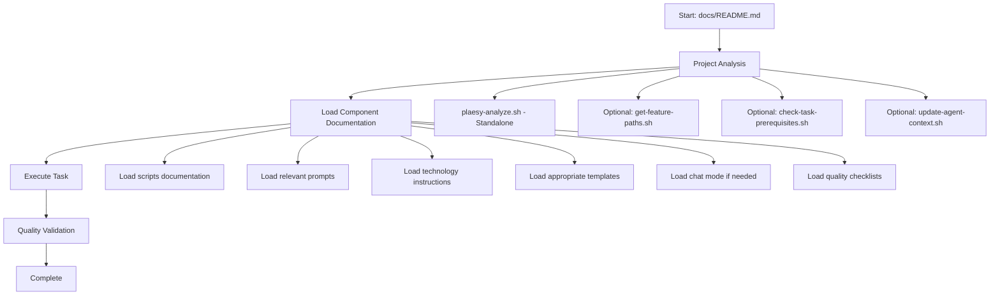

# 📚 Plaesy Spec-Kit Documentation Hub

**Complete documentation framework for AI-powered development automation.**

**Current Version: 0.0.1**

## 🎯 Quick Navigation

This documentation hub provides comprehensive guidance for all Plaesy Spec-Kit components. **AI assistants should start here** and follow the navigation to specific components as needed.

### ⚠️ CRITICAL: Read Architecture First

See [📚 Architecture & Reference Paths Documentation](./ARCHITECTURE.md)

Before working on Plaesy, understand:
- How spec-kit master files relate to project copies
- Which paths to use in instructions vs prompts vs docs
- Flat `.plaesy/memory/` structure (no subdirectories)
- How to avoid broken references

**Read ARCHITECTURE.md first to avoid reference mistakes.**

---

### 🚀 For AI Assistants - Critical First Steps

**When you encounter a Plaesy project, ALWAYS start with project analysis:**

```bash
# 1️⃣ CRITICAL: Understand project structure (Standalone Analysis)
./scripts/bash/plaesy-analyze.sh    # Linux/macOS
./scripts/powershell/plaesy-analyze.ps1    # Windows PowerShell

# Or if Plaesy CLI is installed:
plaesy analyze

# 2️⃣ Optional: Additional context scripts (if available)
./scripts/bash/get-feature-paths.sh        # Get current feature context
./scripts/bash/check-task-prerequisites.sh  # Validate development setup
./scripts/bash/update-agent-context.sh     # Update AI context understanding
```

**🎯 The plaesy-analyze script is comprehensive and standalone:**
- Generates complete project analysis (project.json + project.structure.json)
- Works across all platforms (Bash + PowerShell)
- No prerequisites required
- AI-ready output for immediate use

**📖 Then explore specific components based on your needs:**

```bash
# Need to understand automation scripts?
→ See [Scripts Documentation](./scripts/README.md)

# Need AI prompts for specific tasks?
→ See [Prompts Documentation](./prompts/README.md)

# Need technology-specific guidance?
→ See [Instructions Documentation](./instructions/README.md)

# Need project templates?
→ See [Templates Documentation](./templates/README.md)

# Need AI role configurations?
→ See [Chat Modes Documentation](./chatmodes/README.md)

# Need quality checklists?
→ See [Checklists Documentation](./checklists/README.md)
```

---

## 🏗️ Framework Components

| Component | Purpose | Items | Quick Access |
|-----------|---------|-------|--------------|
| **[Scripts](./scripts/README.md)** | Automation scripts for development workflows | Production-ready | [docs/scripts/README.md](./scripts/README.md) |
| **[Prompts](./prompts/README.md)** | AI-optimized prompts for development tasks | Comprehensive | [docs/prompts/README.md](./prompts/README.md) |
| **[Instructions](./instructions/README.md)** | Technology-specific development guidance (auto-loaded to `.plaesy/memory/` per project) | Comprehensive library | [docs/instructions/README.md](./instructions/README.md) |
| **[Templates](./templates/README.md)** | Reusable templates for project structures | Extensive library | [docs/templates/README.md](./templates/README.md) |
| **[Chat Modes](./chatmodes/README.md)** | AI role configurations for specialized contexts | Diverse roles | [docs/chatmodes/README.md](./chatmodes/README.md) |
| **[Checklists](./checklists/README.md)** | Quality assurance and validation frameworks | Quality gates | [docs/checklists/README.md](./checklists/README.md) |

---

## 📖 Component Documentation Structure

### 🔧 [Scripts Documentation](./scripts/README.md)
**Automation scripts for Plaesy workflow management**

- **1 script = 1 documentation file** - Clear and focused
- **Critical scripts**: plaesy-analyze, get-feature-paths, update-agent-context
- **Development scripts**: plaesy-init, create-new-feature, check-prerequisites
- **Platform scripts**: install.sh, config-manager, plaesy-clean

**🎯 AI Priority**: Always read scripts documentation first for workflow understanding.

### 🤖 [Prompts Documentation](./prompts/README.md)
**AI-optimized prompts for automated development**

- **Core workflow prompts**: /start, /continue
- **Analysis phase prompts**: /research, /clarify
- **Design phase prompts**: /design (UI/UX design generation)
- **Development phase prompts**: /flow, /implement, /assess, /optimize, /fix
- **Completion phase prompts**: /save, /doc
- **Shared system prompts**: quality gates, error recovery, protocols

**🎯 AI Priority**: Use prompts based on current development phase and task requirements.

### 📖 [Instructions Documentation](./instructions/README.md)
**Technology-specific development guidance (auto-loaded to per-project `.plaesy/memory/`)**

- **Frontend frameworks**: React.js, Next.js, Angular, React Native, Dart/Flutter
- **Backend frameworks**: Spring Boot, NestJS, Rails
- **Programming languages**: Java, Go, Rust, Python, C#, SQL
- **DevOps practices**: Kubernetes, Terraform, CI/CD, Docker
- **Security practices**: OWASP, secure coding, compliance
- **Development practices**: TDD, Git workflows, Skills authoring, Changelog generation

**📌 Architecture Note**: Instructions stored in `instructions/` (shared reference) are auto-copied to per-project `.plaesy/memory/` during `plaesy init`, based on detected technologies. Each project contains only its relevant instructions (self-contained).

**🎯 AI Priority**: Instructions auto-load to per-project memory based on detected technology stack.

### 📋 [Templates Documentation](./templates/README.md)
**Reusable templates for project documentation and structure**

- **Project specification templates**: spec, srs, sdd, prd
- **Development templates**: application, service, API documentation
- **Quality templates**: test plans, security assessment, deployment guides
- **Management templates**: project charter, risk register, communication plans

**🎯 AI Priority**: Use templates for consistent project documentation and structure.

### 💬 [Chat Modes Documentation](./chatmodes/README.md)
**AI role configurations for specialized development contexts**

- **Development roles**: Software Developer, AI Architect, Data Engineer
- **Business roles**: Business Analyst, Project Manager, Product Owner
- **Quality roles**: QA Engineer, Security Engineer, DevOps Engineer
- **Specialized roles**: Solutions Architect, Performance Engineer

**🎯 AI Priority**: Select appropriate chat mode based on current task and context.

### ✅ [Checklists Documentation](./checklists/README.md)
**Quality assurance and validation frameworks**

- **Development lifecycle**: story creation, implementation, completion
- **Role-specific checklists**: PM, PO, SA, QA validation
- **Quality gates**: testing standards, security requirements
- **Process validation**: prerequisites, update procedures

**🎯 AI Priority**: Use checklists to ensure quality and completeness of work.

---

## 🔄 AI Assistant Workflow Integration

### Complete AI Workflow



### Navigation Guidelines for AI

#### **1. Project Understanding Phase**
```bash
# Always start here (Standalone - Cross Platform)
./scripts/bash/plaesy-analyze.sh      # Linux/macOS
./scripts/powershell/plaesy-analyze.ps1  # Windows PowerShell

# Or use Plaesy CLI:
plaesy analyze

# Optional additional scripts (if needed):
./scripts/bash/get-feature-paths.sh      # Get feature context
./scripts/bash/check-task-prerequisites.sh  # Check prerequisites
./scripts/bash/update-agent-context.sh     # Update context
```

#### **2. Task Selection Phase**
```bash
# Based on task type, load relevant documentation:

# For automation/scripting tasks:
→ docs/scripts/README.md

# For new feature development:
→ docs/prompts/README.md (for /start, /clarify, /design, /implement)
→ docs/templates/README.md (for structure templates)
→ docs/prompts/design.md (for UI/UX design phase)

# For existing project work:
→ docs/instructions/README.md (for technology guidance)
→ docs/chatmodes/README.md (for role-based approach)

# For quality assurance:
→ docs/checklists/README.md
```

#### **3. Execution Phase**
```bash
# Follow specific component documentation:
→ Use prompts from docs/prompts/README.md
→ Follow instructions from docs/instructions/README.md
→ Apply templates from docs/templates/README.md
→ Validate with checklists from docs/checklists/README.md
```

---

## 🎯 Best Practices for AI Assistants

### Documentation Navigation Rules

1. **Start with docs/README.md** - Always begin here for overview
2. **Execute 4-script sequence** - Critical for context understanding
3. **Load component-specific docs** - Based on task requirements
4. **Follow component guidance** - Each component has specific instructions
5. **Maintain context** - Use update-agent-context.sh regularly

### Component Selection Guidelines

| Task Type | Primary Components | Secondary Components |
|-----------|-------------------|---------------------|
| **Project Analysis** | scripts, instructions | prompts |
| **Feature Development** | prompts, templates, scripts | instructions, checklists |
| **Code Review** | checklists, instructions | chatmodes, scripts |
| **Documentation** | templates, instructions | prompts |
| **Troubleshooting** | scripts, checklists | instructions |

### Quality Assurance Workflow

```bash
# Before completing any task:
1. Load relevant checklists from docs/checklists/README.md
2. Validate against quality gates
3. Use templates from docs/templates/README.md for consistency
4. Update context with docs/scripts/README.md guidance
```

---

## 📞 Support and Resources

### Documentation Structure

```
docs/
├── README.md                    # This file - Main navigation hub
├── scripts/README.md            # Scripts documentation
│   └── platform-detector.md     # PowerShell auto-detection feature
├── prompts/README.md            # Prompts catalog
├── instructions/README.md       # Technology guides
├── templates/README.md          # Template library
├── chatmodes/README.md          # AI role configs
└── checklists/README.md         # Quality frameworks
```

### Getting Help

1. **Start Here**: Read this README.md completely
2. **Component Issues**: Check specific component README files
3. **Script Problems**: See docs/scripts/README.md
4. **Platform Issues**: Check relevant instructions documentation
5. **General Help**: Check main project README.md

### Community Resources

- **GitHub Issues**: [github.com/plaesy/spec-kit/issues](https://github.com/plaesy/spec-kit/issues)
- **Discussions**: [github.com/plaesy/spec-kit/discussions](https://github.com/plaesy/spec-kit/discussions)
- **Documentation Issues**: Report documentation problems in GitHub issues

---

**📚 This documentation hub serves as the central navigation point for Plaesy Spec-Kit. AI assistants should start here and follow the structured navigation to find relevant information for any development task.**