# 💬 Plaesy Agents Documentation

**AI-powered role-based agent configurations for specialized development contexts.**

## 🎯 Overview

The Plaesy agents system provides specialized AI configurations for different roles and contexts in software development. Each agent configures the AI with specific expertise, communication style, and
decision-making frameworks tailored to that role.

## 📚 Agent Categories

### 🔧 Development & Engineering Roles

| Agent | Role | Focus Areas | Expertise |
|-----------|------|-------------|-----------|
| **[dev.agents.md](../../agents/dev.agents.md)** | Technical Implementation Expert | Code implementation, TDD, debugging | Full-stack implementation |
| **[ai-architect.agents.md](../../agents/ai-architect.agents.md)** | AI Architect | AI system design, ML engineering | AI/ML architecture |
| **[data-engineer.agents.md](../../agents/data-engineer.agents.md)** | Data Engineer | Data pipelines, ETL, databases | Data infrastructure |
| **[devops.agents.md](../../agents/devops.agents.md)** | DevOps Engineer | CI/CD, infrastructure, deployment | Operations automation |
| **[devsecops.agents.md](../../agents/devsecops.agents.md)** | DevSecOps Engineer | Security in DevOps, secure pipelines | Security integration |
| **[mlops.agents.md](../../agents/mlops.agents.md)** | MLOps Engineer | ML operations, model deployment | ML infrastructure |

### 📋 Business & Analysis Roles

| Agent | Role | Focus Areas | Deliverables |
|-----------|------|-------------|-------------|
| **[ba.agents.md](../../agents/ba.agents.md)** | Business Analyst | Requirements, process analysis | Business requirements |
| **[pm.agents.md](../../agents/pm.agents.md)** | Product Manager | Product strategy, roadmaps, prioritization | Product strategies, PRDs, go-to-market strategies |
| **[po.agents.md](../../agents/po.agents.md)** | Product Owner | Backlog management, user stories, acceptance criteria | Prioritized backlogs, user stories, acceptance criteria |
| **[market-research-analyst.agents.md](../../agents/market-research-analyst.agents.md)** | Market Research Analyst | Market analysis, competitive research | Market insights |

### 🎨 Design & User Experience Roles

| Agent | Role | Focus Areas | Deliverables |
|-----------|------|-------------|-------------|
| **[designer.agents.md](../../agents/designer.agents.md)** | UX/UI Designer | UI/UX design, design systems, user research | Design specifications |
| **[accessibility.agents.md](../../agents/accessibility.agents.md)** | Accessibility Specialist | Accessibility standards, inclusive design | Accessibility compliance |

### 🔒 Security & Compliance Roles

| Agent | Role | Focus Areas | Standards |
|-----------|------|-------------|----------|
| **[security.agents.md](../../agents/security.agents.md)** | Security Engineer | Security analysis, vulnerability assessment | Security standards |
| **[compliance.agents.md](../../agents/compliance.agents.md)** | Compliance Officer | Regulatory compliance, audits | Compliance frameworks |
| **[privacy-legal.agents.md](../../agents/privacy-legal.agents.md)** | Privacy/Legal Counsel | Privacy regulations, legal risk, privacy-by-design | DPIAs, DPAs, legal risk assessments |

### 📊 Quality & Operations Roles

| Agent | Role | Focus Areas | Quality Metrics |
|-----------|------|-------------|----------------|
| **[qa.agents.md](../../agents/qa.agents.md)** | QA Specialist | Testing strategy, test automation, quality gates | Quality standards |
| **[sre.agents.md](../../agents/sre.agents.md)** | Site Reliability Engineer | Reliability, monitoring, incident response | Reliability metrics |

### ✍️ Prompt & Instruction Quality

| Agent | Role | Focus Areas | Output Contract |
|-----------|------|-------------|-----------------|
| **[pe.agents.md](../../agents/pe.agents.md)** | Prompt Engineer | Prompt structure, reasoning order, specificity, examples | `<reasoning>` assessment + improved prompt (nothing else) |

### 🔍 Analysis & Strategy Roles

| Agent | Role | Focus Areas | Analysis Type |
|-----------|------|-------------|---------------|
| **[sa.agents.md](../../agents/sa.agents.md)** | Solution Architect | System architecture, technical strategy | Architecture design |
| **[tw.agents.md](../../agents/tw.agents.md)** | Technical Writer | Documentation, knowledge management | Technical documentation |
| **[sm.agents.md](../../agents/sm.agents.md)** | Scrum Master | Agile facilitation, team coaching | Agile practices |
| **[bo.agents.md](../../agents/bo.agents.md)** | Business Owner | Business strategy, decision making | Business outcomes |

### 🎯 Decision & Deliberation

| Agent | Role | Focus Areas | Decision Type |
|-----------|------|-------------|---------------|
| **[nara.agents.md](../../agents/nara.agents.md)** | Decision Oracle | Multi-perspective deliberation, decision making | Strategic & tactical decisions |

---

## 🔄 Agent Integration Workflow

### Agent Selection Process

```mermaid

graph TD
    A[Project Context Analysis] --> B{Required Role?}
    B --> C[Development Need]
    B --> D[Business Need]
    B --> E[Design Requirement]
    B --> F[Security or Legal Concern]
    B --> G[Quality or Reliability Need]
    B --> H[Prompt or Instruction Quality]
    B --> I[Ambiguous Cross-Role Decision]

    C --> C1[dev.agents.md]
    C --> C2[ai-architect.agents.md]
    C --> C3[data-engineer.agents.md]
    C --> C4[mlops.agents.md]
    C --> C5[devops.agents.md]
    C --> C6[sa.agents.md]
    C --> C7[devsecops.agents.md]

    D --> D1[ba.agents.md]
    D --> D2[pm.agents.md]
    D --> D3[po.agents.md]
    D --> D4[bo.agents.md]
    D --> D5[market-research-analyst.agents.md]
    D --> D6[sm.agents.md]

    E --> E1[designer.agents.md]
    E --> E2[accessibility.agents.md]

    F --> F1[security.agents.md]
    F --> F2[compliance.agents.md]
    F --> F3[privacy-legal.agents.md]

    G --> G1[qa.agents.md]
    G --> G2[sre.agents.md]
    G --> G3[tw.agents.md]

    H --> H1[pe.agents.md]

    I --> I1[nara.agents.md]

    B --> L[Load Agent Configuration]
    L --> M[Apply Role-Specific Expertise]
    M --> N[Contextual AI Interaction]

```



### Multi-Role Collaboration

#### **Team Simulation Mode**

For complex projects requiring multiple perspectives:

```bash

# Example team collaboration sequence:
1. @ba               # Business analysis and requirements
2. @sa               # Architecture design and planning
3. @dev              # Implementation and development
4. @qa               # Quality assurance and testing
5. @devops           # Deployment and operations
6. @nara             # Decision making and deliberation (can be called anytime)
```

**Note**: Use `@agent` to consult a specific perspective. Use `@nara` to gather multiple perspectives and make decisions.

#### **Role Transition Guidelines**

- **Context Preservation**: Maintain context when switching roles
- **Handoff Documentation**: Document role transition points
- **Collaborative Decision Making**: Combine insights from multiple roles
- **Quality Validation**: Validate decisions across relevant roles

---

## 🎯 Agent Structure

### Standard Agent Format

Every file in `agents/` follows this exact structure. `templates/agents.template.md`
is the source of truth; `instructions/agents.instructions.md` is the authoring
contract that explains each section.

```markdown
---
description: "One sentence — the role, its mandate, and its output contract"
---

# [Role Name] Agent

## Role Definition (RACE Framework)

**Role**: [Who the agent is and its expertise]
**Action**: [What the agent does]
**Context**: [Constraints and constitutional context it operates within]
**Execute**: [Deliverables and behavior]

## Constitutional Context (NON-NEGOTIABLE)

- [Non-negotiable guardrails, one per bullet, bold label + statement]

## Response Style & Behavior

- **[Key]**: [Tone, approach, questions, deliverables, collaboration, ...]

## Key Capabilities

- **[Capability]**: [What the role can do, one bullet each]

## Boundaries & Escalation

- **Owns**: [Decisions this role makes alone]
- **Defers to**: [Roles this role hands work to, and what]
- **Escalate to @[role] when**: [A single binary condition]

## Example Use Cases

- [Scenario descriptions]

## Example

- Input: "<example user prompt>"
- Expected Output Format: `[format]`
- Output: "<short example of the expected agent reply>"

## Example 2

- Input: "<second example user prompt>"
- Expected Output Format: `[format]`
- Output: "<short example of the expected agent reply>"
```

### Agent Components

#### **Role Definition (RACE Framework)**

- **Role**: Identity, seniority, and domain expertise
- **Action**: The primary actions the role takes
- **Context**: The constitutional constraints the role works within
- **Execute**: The deliverables the role is accountable for

#### **Constitutional Context (NON-NEGOTIABLE)**

- Hard guardrails that are never traded away for delivery speed
- Written as bold label + one concrete statement (a testable rule, not a slogan)

#### **Response Style & Behavior**

- Tones, questioning habits, and deliverable expectations for the role
- Allowed keys: `Communication`, `Approach`, `Questions`, `Deliverables`,
  `Collaboration`, `Framework Integration`, `Documentation`, `Monitoring`,
  `Focus`, `Ambiguity`, `Length`, `Safety`, `Minimal changes`, `Language`,
  `Placeholders`

#### **Boundaries & Escalation**

- **Owns**: the decisions this role makes without escalation
- **Defers to**: the roles this role hands work to, and what it hands over
- **Escalate to @[role] when**: one binary condition that triggers a handoff

This block is what keeps overlapping roles (e.g. `pm` vs `po`, `security` vs
`devsecops`, `devops` vs `sre`) from both claiming the same work.

---

## 🔧 Agent Configuration

### AI Platform Integration

#### **Platform-Specific Configurations**

Each agent is optimized for different AI platforms:

| Platform | Integration | Features | Customization |
|----------|-------------|----------|---------------|
| **Claude Code** | Native integration | Full tool access | Custom prompts |
| **GitHub Copilot** | VS Code integration | Code completion | Context-aware suggestions |
| **Cursor AI** | IDE integration | Refactoring support | Enhanced debugging |
| **Generic AI** | Universal compatibility | Structured responses | Detailed instructions |

#### **Configuration Loading**

```bash

# Automatic agent loading:
1. Analyze project context and requirements
2. Determine most appropriate role for current task
3. Load role-specific agent configuration
4. Apply role-specific expertise and communication style
5. Validate role alignment with project needs
```

### Context Management

#### **Role Context Preservation**

- **Role Memory**: Maintain role context across conversations
- **Expertise Retention**: Preserve role-specific knowledge and insights
- **Decision History**: Track decisions made in each role context
- **Quality Standards**: Maintain role-specific quality standards

#### **Context Switching**

- **Smooth Transitions**: Seamless transitions between roles
- **Context Handoff**: Proper handoff of context between roles
- **Collaboration History**: Track collaboration across roles
- **Decision Consistency**: Ensure consistency in decisions across roles

---

## 🚀 Usage Guidelines

### For AI Assistants

#### **Agent Activation**

There is no `/agent` command. Agents are activated two ways:

1. **By role mention** — refer to a role in conversation as `@role-name`
   (`@dev`, `@ba`, `@security`). The AI loads `agents/<role-name>.agents.md`
   as `.plaesy/roles/<role-name>.md`.
2. **By command scope** — the dimension-scoped commands route to specific roles
   automatically. See the `Delegates To` column in `prompts/assess.md`
   (e.g. `/assess:technical` → `dev` + `devsecops`).

```bash

# Role mention (in conversation, not a shell command):
@dev                # technical implementation expert
@ba                 # business analyst
@security           # security engineer

# Command scope (routes to a fixed role set):
/assess:technical   # -> dev, devsecops
/assess:product     # -> pm, ba
```

#### **Role-Specific Interaction Guidelines**

1. **Role Alignment**: Ensure interactions align with activated role
2. **Expertise Application**: Apply role-specific expertise appropriately
3. **Communication Style**: Maintain role-specific communication style
4. **Quality Standards**: Follow role-specific quality standards
5. **Collaboration**: Collaborate effectively with other roles

#### **Best Practices**

- **Role Consistency**: Maintain consistent role behavior throughout session
- **Expertise Boundaries**: Stay within expertise boundaries of the role
- **Quality Focus**: Prioritize quality standards specific to the role
- **Stakeholder Awareness**: Consider stakeholder needs relevant to the role

### For Development Teams

#### **Role Selection Guidelines**

1. **Project Phase**: Select role based on current project phase
2. **Task Requirements**: Match role to specific task requirements
3. **Expertise Needs**: Choose role with relevant expertise
4. **Collaboration Needs**: Consider collaboration requirements
5. **Quality Standards**: Ensure role meets quality requirements

#### **Team Integration**

- **Role Clarity**: Clearly define roles and responsibilities
- **Collaboration Protocols**: Establish protocols for role collaboration
- **Communication Standards**: Set communication standards for role interactions
- **Quality Assurance**: Implement quality assurance across roles

---

## 📊 Role Specializations

### 🔧 Development Roles Deep Dive

#### **Technical Implementation Expert (dev.agents.md)**

- **Core Expertise**: Full-stack implementation, TDD, debugging
- **Communication Style**: Technical, solution-oriented, code examples inline
- **Decision Making**: Technical feasibility, implementation approach
- **Key Deliverables**: Working code, test suites, technical documentation, deployment configs

#### **AI Architect (ai-architect.agents.md)**

- **Core Expertise**: AI/ML system design, model architecture
- **Communication Style**: Strategic, analytical, forward-thinking
- **Decision Making**: Technical strategy, architecture decisions
- **Key Deliverables**: Architecture diagrams, ML pipeline designs

#### **DevOps Engineer (devops.agents.md)**

- **Core Expertise**: CI/CD, infrastructure, automation
- **Communication Style**: Process-oriented, systematic, efficient
- **Decision Making**: Operational efficiency, scalability, reliability
- **Key Deliverables**: Deployment pipelines, infrastructure code

### 📋 Business Roles Deep Dive

#### **Business Analyst (ba.agents.md)**

- **Core Expertise**: Requirements analysis, process modeling
- **Communication Style**: Inquisitive, analytical, user-focused
- **Decision Making**: Business value, user needs, requirements
- **Key Deliverables**: Requirements documents, process diagrams

#### **Product Manager (pm.agents.md)**

- **Core Expertise**: Product strategy, roadmap planning, feature prioritization
- **Communication Style**: Strategic, outcome-focused, data-driven
- **Decision Making**: Product value trade-offs, roadmap sequencing
- **Key Deliverables**: Product strategies, roadmaps, PRDs, go-to-market strategies, KPIs

#### **Product Owner (po.agents.md)**

- **Core Expertise**: Backlog management, user stories, acceptance criteria
- **Communication Style**: Clear, decisive, value-focused
- **Decision Making**: Backlog ordering, story readiness, acceptance sign-off
- **Key Deliverables**: Prioritized backlogs, user stories, acceptance criteria

### 🔒 Security Roles Deep Dive

#### **Security Engineer (security.agents.md)**

- **Core Expertise**: Security analysis, vulnerability assessment
- **Communication Style**: Risk-focused, cautious, thorough
- **Decision Making**: Security risk, compliance requirements
- **Key Deliverables**: Security assessments, vulnerability reports

#### **Compliance Officer (compliance.agents.md)**

- **Core Expertise**: Regulatory compliance, audit preparation
- **Communication Style**: Formal, detail-oriented, compliance-focused
- **Decision Making**: Regulatory requirements, compliance risk
- **Key Deliverables**: Compliance reports, audit documentation

---

## 🔧 Customization and Extension

### Creating Custom Agents

#### **Agent Development Process**

1. **Role Definition**: Write the `description` frontmatter and the RACE block
2. **Constitutional Context**: List the non-negotiable guardrails for the role
3. **Response Style**: Define tone, questioning habits, and deliverable expectations
4. **Key Capabilities**: List what the role can actually do, one bullet each
5. **Boundaries & Escalation**: State what the role owns, what it defers, and the
   single binary condition that triggers escalation
6. **Examples**: Add at least one `## Example` with Input / Expected Output Format / Output
7. **Cross-check**: Every `@role` mentioned must resolve to an existing
   `agents/*.agents.md` file

#### **Quality Standards for Agents**

- **Role Clarity**: The `description` and H1 must name the same role
- **Expertise Accuracy**: Accurately represent the role's expertise, no borrowed
  focus areas from a sibling role
- **Boundaries Present**: `## Boundaries & Escalation` present with all three fields
- **Resolvable Mentions**: `@role` references point at real agent files
- **Template Conformance**: Section names match `templates/agents.template.md`

### Agent Maintenance

#### **Regular Updates**

- **Industry Changes**: Update for industry practice changes
- **Technology Evolution**: Incorporate new technology impacts
- **Best Practice Evolution**: Update best practices
- **Feedback Integration**: Incorporate user feedback

#### **Community Contributions**

- **Role Suggestions**: Community suggestions for new roles
- **Expertise Updates**: Community updates to role expertise
- **Best Practice Sharing**: Sharing of role-specific best practices
- **Quality Improvements**: Community-driven quality improvements

---

## 🆘 Troubleshooting

### Common Agent Issues

#### **Role Selection Problems**

```bash

# Symptoms: Wrong role selected or role doesn't fit task
# Solutions:
1. Analyze task requirements more carefully
2. Consider combining multiple roles
3. Create custom role if needed
4. Review role definitions and expertise areas
```

#### **Context Switching Issues**

```bash

# Symptoms: Lost context when switching roles
# Solutions:
1. Use proper context handoff procedures
2. Document role transition points
3. Maintain collaboration history
4. Use context preservation features
```

#### **Quality Issues**

```bash

# Symptoms: Role doesn't meet quality expectations
# Solutions:
1. Review role quality standards
2. Update role expertise areas
3. Improve role definition
4. Gather feedback for role improvement
```

---

## 📞 Support and Resources

### Documentation Resources

- **Main Documentation**: [../../README.md](../../README.md)
- **Instructions Integration**: [../instructions/README.md](../instructions/README.md)
- **Prompts Integration**: [../prompts/README.md](../prompts/README.md)

### Role-Specific Resources

- **Industry Standards**: Links to industry standards for each role
- **Certification Resources**: Certification and training resources
- **Best Practice Guides**: Role-specific best practice guides
- **Community Forums**: Role-specific community discussions

### Support Channels

- **GitHub Issues**: [github.com/plaesy/spec-kit/issues](https://github.com/plaesy/spec-kit/issues)
- **Discussions**: [github.com/plaesy/spec-kit/discussions](https://github.com/plaesy/spec-kit/discussions)
- **Role Requests**: Request new roles or role modifications

---

**💬 This agents documentation provides comprehensive guidance for using, customizing, and extending role-based AI configurations within the Plaesy framework. All agents are designed to provide
specialized expertise and maintain high-quality interactions for specific development contexts.**
