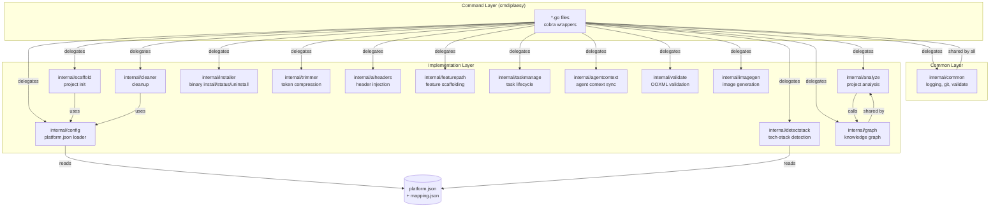

# Architecture

## High-Level Design

The `plaesy` binary is a **single-file Go CLI** built on [Cobra](https://github.com/spf13/cobra).
Its architecture follows a strict two-layer split:

1. **Command layer** — each subcommand is a thin cobra wrapper in
   `scripts/cmd/plaesy/*.go` that parses flags and delegates to an internal
   package. No business logic lives in the command files.
2. **Implementation layer** — each subcommand's logic lives in a
   matching package under `scripts/internal/<name>/`, using only the Go
   standard library plus shared helpers in `scripts/internal/common/`.

Commands auto-register via `init() { register(...) }` (see
`scripts/cmd/plaesy/registry.go:9-11`) and a single `registry` slice consumed by
`main.go:20`. Adding a command never requires editing `main.go`.

### Configuration-Driven Architecture

Platform behavior — which files go where for Claude Code, Copilot, Cursor, etc. —
is centralized in `scripts/configs/platform.json` and loaded by
`internal/config` (`scripts/internal/config/config.go:82`). The `init` and
`clean` commands read this config to resolve platform-specific paths
(`scripts/internal/scaffold/init.go:48`, `scripts/cmd/plaesy/clean.go:68`).

### Cross-Platform Path Handling

On Windows, `git rev-parse --show-toplevel` can return MSYS2-style paths
(`/c/Users/...`). The `common.GetRepoRoot()` function normalizes these to native
Windows paths (`C:\Users\...`) via `toNativePath()`
(`scripts/internal/common/gitpaths.go:17-29`), so `filepath.Join` and
`os.Stat` work correctly across all commands.

## Component Relationships



## Data Flow

### Analysis Pipeline (`plaesy analyze`)

```mermaid
flowchart LR
    A[pl aesy analyze<br/>cmd/plaesy/analyze.go] --> B[internal/analyze<br/>Run()]
    B --> C[walkProject<br/>internal/analyze/walk.go]
    C --> D[detect frameworks<br/>internal/analyze/detect.go]
    D --> E[generate project.json<br/>internal/analyze/insights.go]
    D --> F[generate structure.json<br/>internal/analyze/insights.go]
    E --> G[generate overview.md<br/>internal/analyze/output.go]
    F --> G
    B -->|NoGraph=false| H[buildGraph<br/>calls internal/graph]
    H --> I[project.graph.json<br/>+ project.html<br/>+ reports.md]
    H -->|fingerprint check| J[skip if unchanged<br/>internal/analyze/analyze.go:84]
```

## External Dependencies

| Dependency | Version | Used By | Purpose |
|---|---|---|---|
| `github.com/spf13/cobra` | v1.10.2 | cmd/plaesy | CLI command framework |
| `github.com/inconshreveable/mousetrap` | v1.1.0 (indirect) | cmd/plaesy | Shell completion integration |
| `github.com/spf13/pflag` | v0.9 (indirect) | cmd/plaesy | POSIX flag parsing (via cobra) |

All internal packages use the **Go standard library only** — no HTTP clients,
databases, or third-party libraries beyond cobra/pflag/mousetrap.

## Key Design Decisions

1. **Single binary, no install script**: The binary copies itself to
   `%LOCALAPPDATA%\Plaesy\bin` (Windows) or `$HOME/.local/bin` (Unix) via
   `internal/installer` (`scripts/internal/installer/installer.go:33-51`).
   No shell wrapper or git clone is needed.

2. **Fingerprint-based caching**: `plaesy analyze` and `plaesy graph` skip
   regeneration when the source fingerprint is unchanged
   (`scripts/internal/analyze/analyze.go:84`, `scripts/internal/graph/build.go`).

3. **Registry-based command registration**: Commands self-register via `init()`,
   avoiding a central `main()` that must be edited for every new command
   (`scripts/cmd/plaesy/registry.go:9-11`).

4. **Dual-layer logging**: `internal/common` provides colored console output +
   optional file logging via `PLAESY_DEBUG` / `PLAESY_LOG_FILE`
   environment variables (`scripts/internal/common/logging.go:22-26`).
