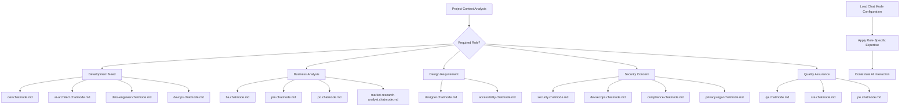

# 💬 Plaesy Chat Modes Documentation

**AI-powered role-based chat configurations for specialized development contexts.**

## 🎯 Overview

The Plaesy chat modes system provides specialized AI configurations for different roles and contexts in software development. Each chat mode configures the AI with specific expertise, communication style, and decision-making frameworks tailored to that role.

## 📚 Chat Mode Categories

### 🔧 Development & Engineering Roles
| Chat Mode | Role | Focus Areas | Expertise |
|-----------|------|-------------|-----------|
| **[dev.chatmode.md](./dev.chatmode.md)** | Software Developer | Coding, debugging, implementation | Full-stack development |
| **[ai-architect.chatmode.md](./ai-architect.chatmode.md)** | AI Architect | AI system design, ML engineering | AI/ML architecture |
| **[data-engineer.chatmode.md](./data-engineer.chatmode.md)** | Data Engineer | Data pipelines, ETL, databases | Data infrastructure |
| **[devops.chatmode.md](./devops.chatmode.md)** | DevOps Engineer | CI/CD, infrastructure, deployment | Operations automation |
| **[devsecops.chatmode.md](./devsecops.chatmode.md)** | DevSecOps Engineer | Security in DevOps, secure pipelines | Security integration |
| **[mlops.chatmode.md](./mlops.chatmode.md)** | MLOps Engineer | ML operations, model deployment | ML infrastructure |

### 📋 Business & Analysis Roles
| Chat Mode | Role | Focus Areas | Deliverables |
|-----------|------|-------------|-------------|
| **[ba.chatmode.md](./ba.chatmode.md)** | Business Analyst | Requirements, process analysis | Business requirements |
| **[pm.chatmode.md](./pm.chatmode.md)** | Project Manager | Planning, coordination, delivery | Project management |
| **[po.chatmode.md](./po.chatmode.md)** | Product Owner | Product vision, backlog management | Product strategy |
| **[market-research-analyst.chatmode.md](./market-research-analyst.chatmode.md)** | Market Research Analyst | Market analysis, competitive research | Market insights |

### 🎨 Design & User Experience Roles
| Chat Mode | Role | Focus Areas | Deliverables |
|-----------|------|-------------|-------------|
| **[designer.chatmode.md](./designer.chatmode.md)** | Designer | UI/UX design, user research | Design specifications |
| **[accessibility.chatmode.md](./accessibility.chatmode.md)** | Accessibility Specialist | Accessibility standards, inclusive design | Accessibility compliance |

### 🔒 Security & Compliance Roles
| Chat Mode | Role | Focus Areas | Standards |
|-----------|------|-------------|----------|
| **[security.chatmode.md](./security.chatmode.md)** | Security Engineer | Security analysis, vulnerability assessment | Security standards |
| **[compliance.chatmode.md](./compliance.chatmode.md)** | Compliance Officer | Regulatory compliance, audits | Compliance frameworks |
| **[privacy-legal.chatmode.md](./privacy-legal.chatmode.md)** | Privacy/Legal Expert | Privacy regulations, legal requirements | Legal compliance |

### 📊 Quality & Operations Roles
| Chat Mode | Role | Focus Areas | Quality Metrics |
|-----------|------|-------------|----------------|
| **[qa.chatmode.md](./qa.chatmode.md)** | QA Engineer | Testing, quality assurance | Quality standards |
| **[sre.chatmode.md](./sre.chatmode.md)** | Site Reliability Engineer | Reliability, monitoring, incident response | Reliability metrics |
| **[pe.chatmode.md](./pe.chatmode.md)** | Performance Engineer | Performance optimization, monitoring | Performance metrics |

### 🔍 Analysis & Strategy Roles
| Chat Mode | Role | Focus Areas | Analysis Type |
|-----------|------|-------------|---------------|
| **[sa.chatmode.md](./sa.chatmode.md)** | Solutions Architect | System architecture, technical strategy | Architecture design |
| **[tw.chatmode.md](./tw.chatmode.md)** | Technical Writer | Documentation, knowledge management | Technical documentation |
| **[sm.chatmode.md](./sm.chatmode.md)** | Scrum Master | Agile facilitation, team coaching | Agile practices |
| **[bo.chatmode.md](./bo.chatmode.md)** | Business Owner | Business strategy, decision making | Business outcomes |

### 🎯 Decision & Deliberation
| Chat Mode | Role | Focus Areas | Decision Type |
|-----------|------|-------------|---------------|
| **[nara.chatmode.md](./nara.chatmode.md)** | Decision Oracle | Multi-perspective deliberation, decision making | Strategic & tactical decisions |

---

## 🔄 Chat Mode Integration Workflow

### Chat Mode Selection Process



### Multi-Role Collaboration

#### **Team Simulation Mode**
For complex projects requiring multiple perspectives:

```bash
# Example team collaboration sequence:
1. @ba               # Business analysis and requirements
2. @sa               # Architecture design and planning
3. @dev              # Implementation and development
4. @qa               # Quality assurance and testing
5. @devops           # Deployment and operations
6. @nara             # Decision making and deliberation (can be called anytime)
```

**Note**: Use `@chatmode` to consult a specific perspective. Use `@nara` to gather multiple perspectives and make decisions.

#### **Role Transition Guidelines**
- **Context Preservation**: Maintain context when switching roles
- **Handoff Documentation**: Document role transition points
- **Collaborative Decision Making**: Combine insights from multiple roles
- **Quality Validation**: Validate decisions across relevant roles

---

## 🎯 Chat Mode Structure

### Standard Chat Mode Format

Each chat mode follows this standardized structure:

```markdown
# [Role Name] Chat Mode

## 🎯 Role Definition
[Clear definition of the role and responsibilities]

## 🧠 Expertise Areas
[List of specific expertise areas and knowledge domains]

## 💬 Communication Style
[Guidelines for communication and interaction style]

## 🔧 Decision-Making Framework
[Approach to decision making and problem solving]

## 📋 Deliverables
[Types of deliverables and outputs expected from this role]

## 🔍 Key Questions
[List of key questions this role typically asks]

## 🛡️ Quality Standards
[Quality standards and best practices for this role]

## 🔗 Integration with Other Roles
[How this role collaborates with other roles]

## 📚 Knowledge Sources
[Key knowledge sources and references for this role]
```

### Chat Mode Components

#### **Role Definition**
- **Primary Responsibilities**: Core responsibilities of the role
- **Scope of Authority**: Decision-making authority and boundaries
- **Key Objectives**: Primary objectives and success criteria
- **Stakeholder Interactions**: Key stakeholders and interaction patterns

#### **Expertise Areas**
- **Technical Skills**: Specific technical skills and knowledge
- **Domain Knowledge**: Industry and domain-specific expertise
- **Tool Proficiency**: Tools and platforms the role is proficient with
- **Best Practices**: Best practices specific to the role

#### **Communication Style**
- **Tone and Language**: Preferred communication style and language
- **Questioning Approach**: How the role approaches asking questions
- **Feedback Style**: How feedback is provided and received
- **Documentation Preferences**: Documentation style and format preferences

---

## 🔧 Chat Mode Configuration

### AI Platform Integration

#### **Platform-Specific Configurations**
Each chat mode is optimized for different AI platforms:

| Platform | Integration | Features | Customization |
|----------|-------------|----------|---------------|
| **Claude Code** | Native integration | Full tool access | Custom prompts |
| **GitHub Copilot** | VS Code integration | Code completion | Context-aware suggestions |
| **Cursor AI** | IDE integration | Refactoring support | Enhanced debugging |
| **Generic AI** | Universal compatibility | Structured responses | Detailed instructions |

#### **Configuration Loading**
```bash
# Automatic chat mode loading:
1. Analyze project context and requirements
2. Determine most appropriate role for current task
3. Load role-specific chat mode configuration
4. Apply role-specific expertise and communication style
5. Validate role alignment with project needs
```

### Context Management

#### **Role Context Preservation**
- **Role Memory**: Maintain role context across conversations
- **Expertise Retention**: Preserve role-specific knowledge and insights
- **Decision History**: Track decisions made in each role context
- **Quality Standards**: Maintain role-specific quality standards

#### **Context Switching**
- **Smooth Transitions**: Seamless transitions between roles
- **Context Handoff**: Proper handoff of context between roles
- **Collaboration History**: Track collaboration across roles
- **Decision Consistency**: Ensure consistency in decisions across roles

---

## 🚀 Usage Guidelines

### For AI Assistants

#### **Chat Mode Activation**
```bash
# Activate specific chat mode:
/chatmode [role-name]

# Examples:
/chatmode dev           # Activate developer role
/chatmode ba            # Activate business analyst role
/chatmode security      # Activate security engineer role
```

#### **Role-Specific Interaction Guidelines**
1. **Role Alignment**: Ensure interactions align with activated role
2. **Expertise Application**: Apply role-specific expertise appropriately
3. **Communication Style**: Maintain role-specific communication style
4. **Quality Standards**: Follow role-specific quality standards
5. **Collaboration**: Collaborate effectively with other roles

#### **Best Practices**
- **Role Consistency**: Maintain consistent role behavior throughout session
- **Expertise Boundaries**: Stay within expertise boundaries of the role
- **Quality Focus**: Prioritize quality standards specific to the role
- **Stakeholder Awareness**: Consider stakeholder needs relevant to the role

### For Development Teams

#### **Role Selection Guidelines**
1. **Project Phase**: Select role based on current project phase
2. **Task Requirements**: Match role to specific task requirements
3. **Expertise Needs**: Choose role with relevant expertise
4. **Collaboration Needs**: Consider collaboration requirements
5. **Quality Standards**: Ensure role meets quality requirements

#### **Team Integration**
- **Role Clarity**: Clearly define roles and responsibilities
- **Collaboration Protocols**: Establish protocols for role collaboration
- **Communication Standards**: Set communication standards for role interactions
- **Quality Assurance**: Implement quality assurance across roles

---

## 📊 Role Specializations

### 🔧 Development Roles Deep Dive

#### **Software Developer (dev.chatmode.md)**
- **Core Expertise**: Full-stack development, coding, debugging
- **Communication Style**: Technical, precise, solution-focused
- **Decision Making**: Technical feasibility, implementation approach
- **Key Deliverables**: Code, technical documentation, implementation plans

#### **AI Architect (ai-architect.chatmode.md)**
- **Core Expertise**: AI/ML system design, model architecture
- **Communication Style**: Strategic, analytical, forward-thinking
- **Decision Making**: Technical strategy, architecture decisions
- **Key Deliverables**: Architecture diagrams, ML pipeline designs

#### **DevOps Engineer (devops.chatmode.md)**
- **Core Expertise**: CI/CD, infrastructure, automation
- **Communication Style**: Process-oriented, systematic, efficient
- **Decision Making**: Operational efficiency, scalability, reliability
- **Key Deliverables**: Deployment pipelines, infrastructure code

### 📋 Business Roles Deep Dive

#### **Business Analyst (ba.chatmode.md)**
- **Core Expertise**: Requirements analysis, process modeling
- **Communication Style**: Inquisitive, analytical, user-focused
- **Decision Making**: Business value, user needs, requirements
- **Key Deliverables**: Requirements documents, process diagrams

#### **Project Manager (pm.chatmode.md)**
- **Core Expertise**: Project planning, coordination, delivery
- **Communication Style**: Coordinated, timeline-focused, risk-aware
- **Decision Making**: Project success factors, resource allocation
- **Key Deliverables**: Project plans, status reports, risk assessments

### 🔒 Security Roles Deep Dive

#### **Security Engineer (security.chatmode.md)**
- **Core Expertise**: Security analysis, vulnerability assessment
- **Communication Style**: Risk-focused, cautious, thorough
- **Decision Making**: Security risk, compliance requirements
- **Key Deliverables**: Security assessments, vulnerability reports

#### **Compliance Officer (compliance.chatmode.md)**
- **Core Expertise**: Regulatory compliance, audit preparation
- **Communication Style**: Formal, detail-oriented, compliance-focused
- **Decision Making**: Regulatory requirements, compliance risk
- **Key Deliverables**: Compliance reports, audit documentation

---

## 🔧 Customization and Extension

### Creating Custom Chat Modes

#### **Chat Mode Development Process**
1. **Role Definition**: Define the role and its responsibilities
2. **Expertise Identification**: Identify key expertise areas
3. **Communication Style**: Define communication approach
4. **Decision Framework**: Establish decision-making process
5. **Quality Standards**: Define role-specific quality standards
6. **Integration Planning**: Plan integration with other roles

#### **Quality Standards for Chat Modes**
- **Role Clarity**: Clear definition of role and responsibilities
- **Expertise Accuracy**: Accurate representation of role expertise
- **Communication Consistency**: Consistent communication style
- **Integration Compatibility**: Compatibility with other roles
- **Quality Focus**: Emphasis on quality standards

### Chat Mode Maintenance

#### **Regular Updates**
- **Industry Changes**: Update for industry practice changes
- **Technology Evolution**: Incorporate new technology impacts
- **Best Practice Evolution**: Update best practices
- **Feedback Integration**: Incorporate user feedback

#### **Community Contributions**
- **Role Suggestions**: Community suggestions for new roles
- **Expertise Updates**: Community updates to role expertise
- **Best Practice Sharing**: Sharing of role-specific best practices
- **Quality Improvements**: Community-driven quality improvements

---

## 🆘 Troubleshooting

### Common Chat Mode Issues

#### **Role Selection Problems**
```bash
# Symptoms: Wrong role selected or role doesn't fit task
# Solutions:
1. Analyze task requirements more carefully
2. Consider combining multiple roles
3. Create custom role if needed
4. Review role definitions and expertise areas
```

#### **Context Switching Issues**
```bash
# Symptoms: Lost context when switching roles
# Solutions:
1. Use proper context handoff procedures
2. Document role transition points
3. Maintain collaboration history
4. Use context preservation features
```

#### **Quality Issues**
```bash
# Symptoms: Role doesn't meet quality expectations
# Solutions:
1. Review role quality standards
2. Update role expertise areas
3. Improve role definition
4. Gather feedback for role improvement
```

---

## 📞 Support and Resources

### Documentation Resources
- **Main Documentation**: [../README.md](../README.md)
- **Instructions Integration**: [../instructions/README.md](../instructions/README.md)
- **Prompts Integration**: [../prompts/README.md](../prompts/README.md)

### Role-Specific Resources
- **Industry Standards**: Links to industry standards for each role
- **Certification Resources**: Certification and training resources
- **Best Practice Guides**: Role-specific best practice guides
- **Community Forums**: Role-specific community discussions

### Support Channels
- **GitHub Issues**: [github.com/plaesy/spec-kit/issues](https://github.com/plaesy/spec-kit/issues)
- **Discussions**: [github.com/plaesy/spec-kit/discussions](https://github.com/plaesy/spec-kit/discussions)
- **Role Requests**: Request new roles or role modifications

---

**💬 This chat modes documentation provides comprehensive guidance for using, customizing, and extending role-based AI configurations within the Plaesy framework. All chat modes are designed to provide specialized expertise and maintain high-quality interactions for specific development contexts.**