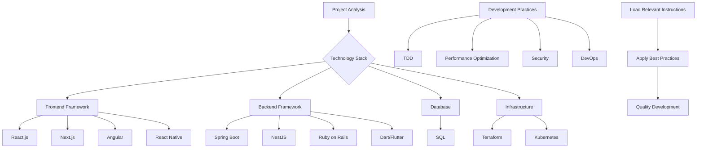

# 📖 Plaesy Instructions Documentation

**Comprehensive instruction library for technology-specific development guidance.**

⚠️ **CRITICAL: Before creating/editing instructions, read** [../ARCHITECTURE.md](../ARCHITECTURE.md) **to understand:**
- How instructions are copied to `.plaesy/memory/`
- Correct reference paths (use `.plaesy/memory/` not `instructions/`)
- No self-references rule
- Cross-reference patterns

## 🎯 Overview

The Plaesy instructions system provides detailed, technology-specific guidance for development teams. Each instruction document contains best practices, coding standards, security guidelines, and optimization techniques tailored to specific technologies and platforms.

## 📍 Architecture: Spec-Kit vs Per-Project

### Spec-Kit Repository (Shared Reference)
- **Location**: `instructions/` folder in spec-kit repo
- **Files**: `*.instructions.md` (comprehensive library)
- **Purpose**: Shared reference templates, mapped via `instructions/mapping.json`
- **Use**: Referenced by CLI and AI assistants for keyword-based detection

### Per-Project (Self-Contained)
- **Location**: `.plaesy/memory/` in each project
- **Files**: Auto-copied during `plaesy init` based on detected technologies
- **Purpose**: Project-specific instructions (only relevant ones copied)
- **Benefits**: Self-contained (CLAUDE.md compliant), lightweight, no duplication

**How it works**: When `plaesy init` runs, it:
1. Analyzes project technologies via `plaesy-analyze`
2. Looks up relevant instructions in `instructions/mapping.json`
3. Copies only matching instructions to `.plaesy/memory/`
4. Project AI context uses per-project copy, not shared reference

## 📚 Instruction Categories

### 🌐 Frontend Framework Instructions
| Instruction | Technology | Focus Areas | Integration |
|-------------|------------|-------------|-------------|
| **[reactjs.instructions.md](./reactjs.instructions.md)** | React.js | Component architecture, hooks, state management | Modern React patterns |
| **[nextjs.instructions.md](./nextjs.instructions.md)** | Next.js | SSR/SSG, routing, performance optimization | Full-stack React |
| **[angular.instructions.md](./angular.instructions.md)** | Angular | Components, services, dependency injection | Enterprise Angular |
| **[react-native.instructions.md](./react-native.instructions.md)** | React Native | Mobile development, native modules | Cross-platform mobile |
| **[dart-n-flutter.instructions.md](./dart-n-flutter.instructions.md)** | Dart/Flutter | Mobile UI, state management | Cross-platform |

### ⚙️ Backend Framework Instructions
| Instruction | Technology | Focus Areas | Architecture |
|-------------|------------|-------------|--------------|
| **[springboot.instructions.md](./springboot.instructions.md)** | Spring Boot | Microservices, Spring ecosystem | Enterprise Java |
| **[nestjs.instructions.md](./nestjs.instructions.md)** | NestJS | Modular architecture, TypeScript | Node.js enterprise |
| **[ruby-on-rails.instructions.md](./ruby-on-rails.instructions.md)** | Rails | Convention over configuration | Rapid development |

### 🔧 Programming Language Instructions
| Instruction | Language | Focus Areas | Best Practices |
|-------------|----------|-------------|----------------|
| **[java.instructions.md](./java.instructions.md)** | Java | OOP, JVM, performance | Enterprise Java |
| **[go.instructions.md](./go.instructions.md)** | Go | Concurrency, performance | Cloud-native |
| **[rust.instructions.md](./rust.instructions.md)** | Rust | Memory safety, performance | Systems programming |
| **[csharp.instructions.md](./csharp.instructions.md)** | C# | .NET ecosystem, async programming | Microsoft stack |
| **[sql.instructions.md](./sql.instructions.md)** | SQL | Database design, optimization | Data management |

### 🛡️ Security & DevOps Instructions
| Instruction | Domain | Focus Areas | Standards |
|-------------|--------|-------------|----------|
| **[security-audit.instructions.md](./security-audit.instructions.md)** | Security | OWASP Top 10, WCAG accessibility, secure coding | Security & compliance |
| **[devops-core-principles.instructions.md](./devops-core-principles.instructions.md)** | DevOps | CI/CD, infrastructure, monitoring | DevOps practices |
| **[terraform.instructions.md](./terraform.instructions.md)** | Infrastructure | IaC, cloud provisioning | Cloud infrastructure |
| **[kubernetes-deployment-best-practices.instructions.md](./kubernetes-deployment-best-practices.instructions.md)** | Kubernetes | Container orchestration | Cloud-native deployment |

### 🚀 Development Practice Instructions
| Instruction | Practice | Focus Areas | Implementation |
|-------------|-----------|-------------|----------------|
| **[tdd-enforcement.instructions.md](./tdd-enforcement.instructions.md)** | TDD | Test-driven development, testing patterns | Quality assurance |
| **[testing-strategy.instructions.md](./testing-strategy.instructions.md)** | Testing | Test pyramid, coverage, CI/CD gates | Comprehensive testing |
| **[performance-baseline.instructions.md](./performance-baseline.instructions.md)** | Performance | Baseline establishment, profiling, optimization | Performance engineering |
| **[brainstorming-techniques.instructions.md](./brainstorming-techniques.instructions.md)** | Brainstorming | Creative problem-solving, ideation | Innovation techniques |

### 📝 Documentation & Communication Instructions
| Instruction | Skill | Focus Areas | Application |
|-------------|-------|-------------|------------|
| **[how-to-create-markdown-document.instructions.md](./how-to-create-markdown-document.instructions.md)** | Documentation | Markdown, technical writing | Documentation standards |
| **[changelog.instructions.md](./changelog.instructions.md)** | Release Management | Changelog, semantic versioning, release notes | Version management |

### 📋 Workflow & Collaboration Instructions
| Instruction | Purpose | Status | Priority |
|-------------|---------|--------|----------|
| **[git.instructions.md](./git.instructions.md)** | Git workflows, branching strategies, commit discipline | ✅ **ACTIVE** | HIGH |
| **[tech-validation.instructions.md](./tech-validation.instructions.md)** | Technology evaluation, framework selection, fallbacks | ✅ **ACTIVE** | HIGH |

### ⚙️ Shared Protocols & System Instructions (Auto-Loaded)
| Instruction | Purpose | Scope | Always Load |
|-------------|---------|-------|------------|
| **[shared-protocols.instructions.md](./shared-protocols.instructions.md)** | Common protocols across all workflows | Workflow states, task management, memory limits | ✅ YES |
| **[quality-gates.instructions.md](./quality-gates.instructions.md)** | Quality validation framework | Coverage, performance, security gates | ✅ YES |
| **[error-recovery.instructions.md](./error-recovery.instructions.md)** | Error classification & recovery | Per-phase recovery strategies | ✅ YES |
| **[date-system.instructions.md](./date-system.instructions.md)** | Date variable system | {{CURRENT_DATE}}, {{CURRENT_YEAR}} | ✅ YES |
| **[plaesy-trim.instructions.md](./plaesy-trim.instructions.md)** | Command output compression | PS1/Bash command wrapping | ✅ YES |
| **[plaesy-graph.instructions.md](./plaesy-graph.instructions.md)** | Knowledge graph tool | Analysis & visualization | ✅ YES |


---

## 🔧 Instruction Integration

### Instruction Selection Framework



### Multi-Technology Projects

#### **Instruction Combination Strategy**
For projects using multiple technologies, combine relevant instructions:

1. **Primary Technology**: Load main framework instruction
2. **Supporting Technologies**: Add supplementary instructions
3. **Cross-Cutting Concerns**: Include security, performance, and DevOps instructions
4. **Development Practices**: Apply TDD and other practice instructions

#### **Example: Full-Stack Web Application**
```
Primary: nextjs.instructions.md + nestjs.instructions.md
Supporting: sql.instructions.md + terraform.instructions.md
Cross-cutting: security-and-owasp.instructions.md + performance-optimization.instructions.md
Practices: tdd-enforcement.instructions.md + devops-core-principles.instructions.md
```

---

## 🎯 Instruction Structure

### Standard Instruction Format

Each instruction follows this standardized structure:

```markdown
# [Technology/Practice Name] Instructions

## 🎯 Purpose
[Brief description of instruction purpose and scope]

## 📋 Prerequisites
[Required knowledge, tools, or setup]

## 🔧 Core Concepts
[Fundamental concepts and principles]

## 📝 Best Practices
[List of best practices with explanations]

## 🛡️ Security Considerations
[Security-specific guidance if applicable]

## 🚀 Performance Optimization
[Performance tips and techniques]

## 🔍 Code Examples
[Practical code examples]

## 📚 Additional Resources
[Links to additional documentation and resources]

## 🔧 Integration with Plaesy
[How to use with Plaesy framework]
```

### Quality Standards

#### **Instruction Quality Criteria**
- **Accuracy**: Up-to-date and technically accurate
- **Completeness**: Covers all essential aspects
- **Clarity**: Clear and easy to understand
- **Practicality**: Practical and applicable examples
- **Integration**: Compatible with Plaesy framework

#### **Content Standards**
- **Current Best Practices**: Reflects current industry standards
- **Version Specific**: Clearly indicates version compatibility
- **Code Quality**: Includes high-quality, tested code examples
- **Security Focus**: Emphasizes secure development practices
- **Performance Awareness**: Includes performance considerations

---

## 🔧 Plaesy Framework Integration

### Automated Instruction Loading

#### **Context-Based Instruction Selection**
The Plaesy framework automatically selects relevant instructions based on:

1. **Project Analysis**: Results from `plaesy-analyze.sh`
2. **Technology Detection**: Identified technologies in project
3. **Framework Detection**: Detected frameworks and platforms
4. **Configuration**: User-specified preferences

#### **Integration with AI Assistants**
```bash
# When AI assistant encounters project:
1. ./bash/plaesy-analyze.sh     # Detect technologies
2. ./bash/get-feature-paths.sh   # Get context
3. Load relevant instructions based on analysis
4. Apply instruction-specific best practices
5. Validate compliance with guidelines
```

### Instruction Application Process

#### **Development Workflow Integration**
1. **Project Initialization**: Load base instructions
2. **Feature Development**: Apply feature-specific instructions
3. **Code Review**: Validate against instruction guidelines
4. **Quality Assurance**: Ensure instruction compliance
5. **Documentation**: Document instruction usage

#### **Quality Gate Integration**
- **Instruction Compliance**: Check adherence to loaded instructions
- **Best Practice Validation**: Validate against instruction guidelines
- **Security Review**: Ensure security instructions are followed
- **Performance Validation**: Check performance optimization guidelines

---

## 🚀 Usage Guidelines

### For AI Assistants

#### **Instruction Loading Protocol**
```bash
# Critical sequence for AI assistants:
1. Run project analysis: ./bash/plaesy-analyze.sh
2. Get feature context: ./bash/get-feature-paths.sh
3. Load relevant instructions based on technology stack
4. Apply instruction-specific guidance
5. Validate compliance with loaded instructions
```

#### **Instruction Application Best Practices**
- **Context Awareness**: Understand project context before applying instructions
- **Technology Specificity**: Use technology-specific instructions when available
- **Cross-Technology Integration**: Combine instructions for multi-technology projects
- **Quality Validation**: Ensure compliance with instruction guidelines

### For Development Teams

#### **Instruction Selection Guidelines**
1. **Project Analysis**: Analyze project requirements and technology stack
2. **Instruction Mapping**: Map technologies to relevant instructions
3. **Customization**: Customize instructions based on project needs
4. **Integration**: Integrate instructions into development workflow
5. **Validation**: Validate instruction compliance regularly

#### **Team Training**
- **Instruction Workshops**: Train team on relevant instructions
- **Best Practice Sessions**: Review instruction best practices
- **Code Reviews**: Include instruction compliance in code reviews
- **Knowledge Sharing**: Share insights from instruction application

---

## 📊 Instruction Categories Deep Dive

### 🌐 Frontend Framework Instructions

#### **React.js Instructions Focus**
- **Component Architecture**: Modern React patterns and best practices
- **State Management**: Redux, Context API, and state management patterns
- **Performance**: Optimization techniques and performance monitoring
- **Testing**: React Testing Library and component testing strategies
- **Security**: Secure React development practices

#### **Next.js Instructions Focus**
- **SSR/SSG**: Server-side rendering and static site generation
- **Routing**: Advanced routing patterns and optimization
- **API Routes**: Backend integration and API development
- **Performance**: Optimization for production environments
- **Deployment**: Production deployment best practices

### ⚙️ Backend Framework Instructions

#### **Spring Boot Instructions Focus**
- **Microservices**: Microservice architecture with Spring Boot
- **Spring Ecosystem**: Integration with Spring projects
- **Security**: Spring Security and secure API development
- **Performance**: JVM optimization and performance tuning
- **Testing**: Comprehensive testing strategies

#### **NestJS Instructions Focus**
- **Modular Architecture**: Module organization and dependency injection
- **TypeScript**: TypeScript best practices and patterns
- **API Development**: RESTful API design and GraphQL
- **Authentication**: JWT and authentication strategies
- **Microservices**: Microservice patterns with NestJS

### 🛡️ Security & Compliance Instructions

#### **Security Audit (OWASP & WCAG)**
- **OWASP Top 10**: Protection against common vulnerabilities
- **Secure Coding**: Security-focused development practices
- **Authentication**: Secure authentication and authorization
- **Data Protection**: Encryption and data security
- **Accessibility (WCAG 2.1 AA)**: Accessibility compliance guidelines
- **Compliance Frameworks**: GDPR, HIPAA, and other standards

---

## 🔧 Customization and Extension

### Creating Custom Instructions

#### **Instruction Development Process**
1. **Identify Need**: Determine technology or practice not covered
2. **Research Best Practices**: Research current best practices
3. **Create Structure**: Follow standard instruction format
4. **Content Development**: Write comprehensive instruction content
5. **Validation**: Validate instruction accuracy and completeness
6. **Integration**: Integrate with Plaesy framework

#### **Quality Assurance**
- **Technical Review**: Review by technical experts
- **Practical Testing**: Test instructions in real projects
- **Peer Review**: Review by other developers
- **Regular Updates**: Keep instructions current with technology changes

### Instruction Maintenance

#### **Regular Updates**
- **Technology Changes**: Update for new versions and features
- **Best Practice Evolution**: Incorporate new best practices
- **Security Updates**: Include new security considerations
- **Performance Improvements**: Add new optimization techniques

#### **Community Contributions**
- **Feedback Collection**: Collect user feedback on instructions
- **Community Contributions**: Accept community contributions
- **Quality Standards**: Maintain high quality standards
- **Version Management**: Track instruction versions and changes

---

## 🆘 Troubleshooting

### Common Instruction Issues

#### **Instruction Selection Problems**
```bash
# Symptoms: Wrong instructions selected or missing instructions
# Solutions:
1. Verify technology detection in project analysis
2. Check instruction naming conventions
3. Validate instruction content for technology match
4. Consider creating custom instructions if needed
```

#### **Integration Issues**
```bash
# Symptoms: Instructions don't integrate with development workflow
# Solutions:
1. Check instruction compatibility with Plaesy framework
2. Validate instruction structure and format
3. Test instruction application in sample projects
4. Update integration scripts if needed
```

#### **Quality Issues**
```bash
# Symptoms: Instructions are outdated or inaccurate
# Solutions:
1. Review and update instruction content
2. Validate against current best practices
3. Test with current technology versions
4. Get community feedback and validation
```

---

## 📞 Support and Resources

### Documentation Resources
- **Main Documentation**: [../README.md](../README.md)
- **Templates Integration**: [../templates/README.md](../templates/README.md)
- **Prompts Integration**: [../prompts/README.md](../prompts/README.md)

### External Resources
- **Official Documentation**: Links to official technology documentation
- **Community Resources**: Community forums and discussion boards
- **Training Materials**: Training and certification resources
- **Best Practice Guides**: Industry best practice guides

### Support Channels
- **GitHub Issues**: [github.com/plaesy/spec-kit/issues](https://github.com/plaesy/spec-kit/issues)
- **Discussions**: [github.com/plaesy/spec-kit/discussions](https://github.com/plaesy/spec-kit/discussions)
- **Instruction Requests**: Request new instructions or updates

---

**📖 This instructions documentation provides comprehensive guidance for using, customizing, and extending technology-specific instructions within the Plaesy framework. All instructions are designed to integrate seamlessly with automated development workflows and ensure best practice compliance.**