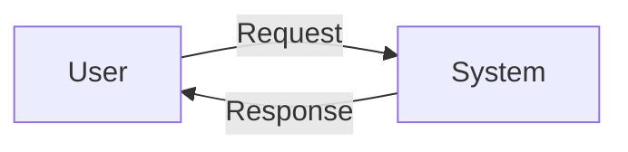

# Context and Data Flow Diagrams (DFD)

Version 0.1
Prepared by <author>
<organization>
<date created>

## 1. Context Diagram (Level 0)
- External entities, system boundary, major data flows
- Notation: Gane-Sarson or Yourdon/DeMarco

## 2. DFD Level 1+
- Processes, data stores, data flows
- Balancing rules from context to Level 1

## 3. Modeling Guidelines
- Naming conventions, decomposition, consistency checks

## 4. Examples and Templates
- Mermaid or PlantUML snippets for diagrams

## 5. Review Checklist
- Completeness, consistency, minimal crossing lines, clear labels
