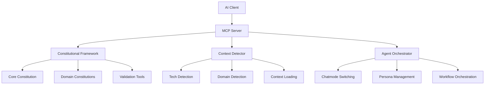

# Spec-Kit MCP Server

Model Context Protocol (MCP) server untuk **Spec-Kit Constitutional Development Framework** yang memungkinkan integrasi dengan berbagai platform AI.

## 🤖 **Apa itu MCP?**

Model Context Protocol (MCP) adalah protokol standar yang dikembangkan Anthropic untuk:
- **Context Loading**: AI dapat mengakses konteks dinamis dari framework
- **Tool Execution**: AI dapat menjalankan tools untuk validasi dan orkestasi
- **Resource Access**: AI dapat membaca constitutional rules dan chatmodes
- **Cross-Platform**: Bekerja di Claude Desktop, VS Code, web interfaces, dll

## 🚀 **Quick Start**

### 1. **Setup & Installation**
```bash
# Jalankan setup script
cd tools/mcp-server
chmod +x setup.sh
./setup.sh

# Pilih platform yang ingin diintegrasikan:
# 1) Claude Desktop
# 2) VS Code Extension  
# 3) Web Interface
# 4) All platforms
```

### 2. **Build & Start Server**
```bash
# Build MCP server
npm run build

# Start server
./start-mcp-server.sh

# Atau manual:
node dist/index.js
```

### 3. **Verify Setup**
```bash
# Jalankan verification script
./verify-setup.sh
```

## 🏗️ **Arsitektur MCP Server**



## 📚 **Resources & Tools**

### **Resources (Context yang bisa diakses AI)**

| Resource URI | Description |
|--------------|-------------|
| `constitutional://core-principles` | Non-negotiable framework rules |
| `constitutional://context/security` | Security constitutional principles |
| `constitutional://context/fintech` | Fintech constitutional principles |
| `constitutional://context/healthcare` | Healthcare constitutional principles |
| `chatmode://dev` | Developer agent persona |
| `chatmode://qa` | QA engineer persona |
| `chatmode://sa` | Solution architect persona |

### **Tools (Actions yang bisa dijalankan AI)**

#### 1. **Context Detection & Loading**
```json
{
  "name": "detect_and_load_context",
  "description": "Auto-detect technology/domain and load appropriate context",
  "input": {
    "content": "Code or conversation to analyze",
    "explicit_domains": ["security", "fintech", "healthcare"]
  }
}
```

**Example Response:**
```json
{
  "detected_technologies": ["react", "typescript"],
  "detected_domains": ["security"],
  "recommended_instructions": ["reactjs.instructions.md", "security-and-owasp.instructions.md"],
  "recommended_chatmodes": ["dev.chatmode.md", "security.chatmode.md"],
  "constitutional_domains": ["security.constitution.md"]
}
```

#### 2. **Agent Persona Switching**
```json
{
  "name": "switch_agent_persona",
  "description": "Switch between agent personas (PM, SA, Dev, QA, etc.)",
  "input": {
    "persona": "qa",
    "context": "Need to review test coverage"
  }
}
```

**Example Response:**
```json
{
  "previous_persona": "dev",
  "current_persona": "qa", 
  "persona_configuration": {
    "name": "Quality Assurance Engineer",
    "capabilities": ["Test Strategy", "Integration Testing", "Quality Gates"],
    "constitutional_requirements": ["Use real dependencies in integration tests", "Follow Given-When-Then structure"]
  }
}
```

#### 3. **Constitutional Compliance Validation**
```json
{
  "name": "validate_constitutional_compliance",
  "description": "Validate code against constitutional principles",
  "input": {
    "code": "function createUser(data) { return api.post('/users', data); }",
    "type": "code",
    "domains": ["security"]
  }
}
```

**Example Response:**
```json
{
  "constitutional_compliance": false,
  "violations": [
    "Missing input validation - All user inputs must be validated",
    "Missing error handling - All public interfaces must handle errors"
  ],
  "recommendations": [
    "Add input validation using schema validation",
    "Implement try-catch error handling"
  ]
}
```

## 🔧 **Platform Integration**

### **Claude Desktop**

1. **Setup Otomatis:**
```bash
./setup.sh
# Pilih option 1 (Claude Desktop)
```

2. **Manual Setup:**
```bash
# macOS
echo '{
  "mcpServers": {
    "spec-kit": {
      "command": "node",
      "args": ["/path/to/spec-kit/tools/mcp-server/dist/index.js"],
      "env": {"SPEC_KIT_ROOT": "/path/to/spec-kit"}
    }
  }
}' > ~/Library/Application\ Support/Claude/claude_desktop_config.json

# Linux  
echo '{
  "mcpServers": {
    "spec-kit": {
      "command": "node", 
      "args": ["/path/to/spec-kit/tools/mcp-server/dist/index.js"],
      "env": {"SPEC_KIT_ROOT": "/path/to/spec-kit"}
    }
  }
}' > ~/.config/claude/claude_desktop_config.json
```

3. **Restart Claude Desktop** dan server akan otomatis terkoneksi.

### **VS Code Extension**

1. **Build Extension:**
```bash
./setup.sh
# Pilih option 2 (VS Code Extension)

cd vscode-extension
npm install
npm run compile
```

2. **Install Extension:**
```bash
# Package extension
vsce package

# Install locally
code --install-extension spec-kit-mcp-*.vsix
```

3. **Configure:**
- Open VS Code Settings
- Search for "Spec-Kit MCP"
- Set framework path: `/path/to/spec-kit`
- Enable auto-context detection

### **Web Interface**

1. **Setup:**
```bash
./setup.sh
# Pilih option 3 (Web Interface)
```

2. **Start Web Server:**
```bash
# MCP server akan listen di port 3001
# WebSocket endpoint: ws://localhost:3001/mcp
node dist/web-server.js
```

3. **Connect dari web application:**
```javascript
const ws = new WebSocket('ws://localhost:3001/mcp');
// Send MCP protocol messages
```

## 💻 **Usage Examples**

### **1. Context Detection dalam Claude**
```
User: "I'm building a React payment component with Stripe integration"

Claude (menggunakan MCP): 
1. Calls detect_and_load_context dengan content
2. Detects: ["react", "fintech"] 
3. Loads: reactjs.instructions.md + fintech.constitution.md
4. Switches to security chatmode untuk payment security
5. Responds dengan context-aware guidance
```

### **2. Constitutional Validation**
```
User: "Review this API code for compliance"

Claude (menggunakan MCP):
1. Calls validate_constitutional_compliance
2. Checks against TDD, security, error handling rules
3. Returns specific violations and recommendations
4. Suggests fixes aligned with constitutional principles
```

### **3. Multi-Agent Workflow**
```
User: "Plan and implement user authentication feature"

Claude (menggunakan MCP):
1. Switches to PM persona → plan feature requirements
2. Switches to SA persona → design architecture  
3. Switches to Security persona → security review
4. Switches to Dev persona → implementation guidance
5. Switches to QA persona → test strategy
```

## 🔍 **Troubleshooting**

### **Common Issues**

1. **MCP Server tidak terkoneksi:**
```bash
# Check if server is running
ps aux | grep "spec-kit.*mcp"

# Check logs
tail -f mcp-server.log

# Restart server
./start-mcp-server.sh
```

2. **Constitutional files tidak ditemukan:**
```bash
# Verify framework structure
./verify-setup.sh

# Check SPEC_KIT_ROOT environment variable
echo $SPEC_KIT_ROOT
```

3. **Permission errors:**
```bash
# Fix permissions
chmod +x *.sh
chmod -R 755 tools/mcp-server
```

### **Debug Mode**
```bash
# Start dengan debug logging
DEBUG=spec-kit:* node dist/index.js

# Test MCP protocol manually
echo '{"jsonrpc":"2.0","id":1,"method":"ping"}' | node dist/index.js
```

## 🚀 **Advanced Features**

### **Custom Constitutional Domains**
```bash
# Add new domain constitution
echo '# Custom Domain Constitution
## Principles...
' > memory/constitution/custom-domain.constitution.md

# Server akan otomatis detect dan load
```

### **Custom Agent Personas**
```bash
# Add new chatmode
echo '---
description: "Custom agent persona"
tools: [...]
---
# Custom Agent Persona
...' > chatmodes/custom.chatmode.md
```

### **Integration dengan CI/CD**
```bash
# Add ke GitHub Actions
- name: Validate Constitutional Compliance
  run: |
    ./tools/mcp-server/start-mcp-server.sh &
    # Run validation tools
    ./scripts/validate-compliance.sh
```

## 📈 **Monitoring & Analytics**

### **Usage Metrics**
- Context detection accuracy
- Agent switching frequency  
- Constitutional violation rates
- Most used resources/tools

### **Performance Monitoring**
- Response times per tool
- Resource loading performance
- Error rates dan debugging

---

## 🎯 **Benefits untuk Framework Anda**

1. **Universal AI Integration**: Satu MCP server → semua platform AI
2. **Constitutional Enforcement**: Real-time compliance checking
3. **Context Awareness**: AI otomatis load instruksi yang relevan
4. **Multi-Agent Orchestration**: Seamless switching antar personas
5. **Scalable**: Tambah domain/teknologi baru tanpa ubah platform AI

Dengan MCP server ini, framework Spec-Kit Anda bisa digunakan di Claude Desktop, VS Code, web interfaces, dan platform AI lainnya dengan pengalaman yang konsisten! 🚀